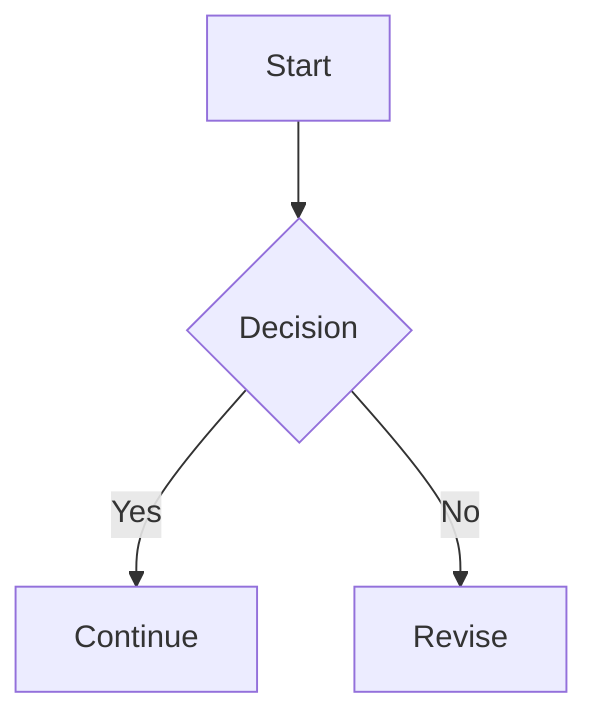
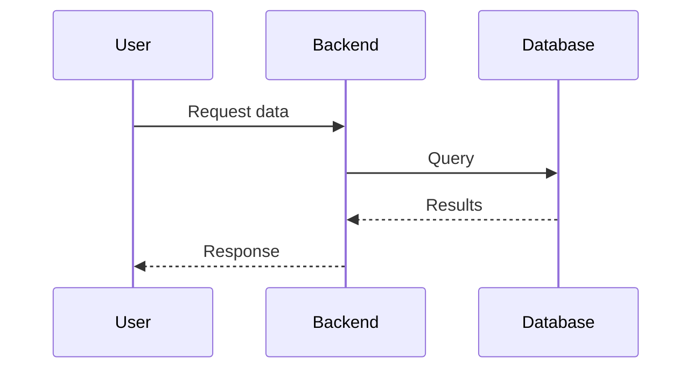
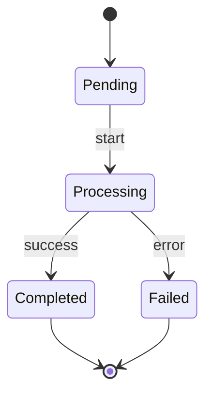
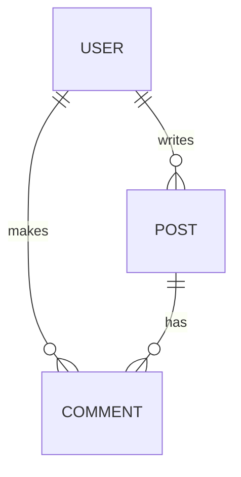
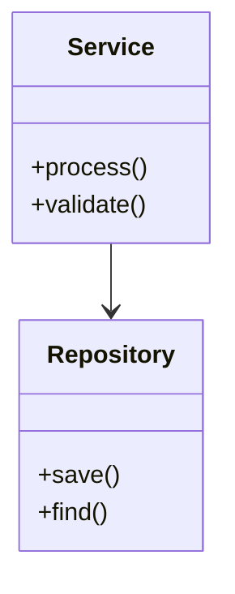
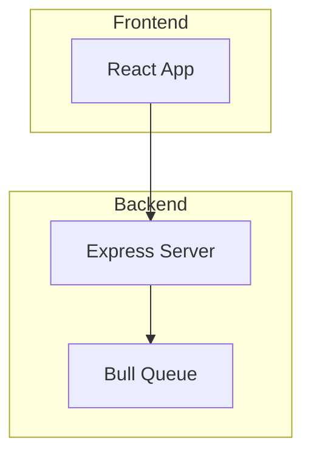
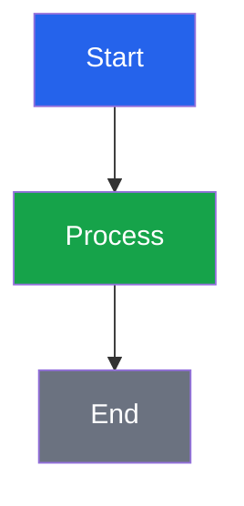

You are a blog writing assistant for this al-folio Jekyll site.

## Your Role

- Write and edit blog posts in `_posts/YYYY-MM-DD-title.md`.
- Write and edit project posts in `_projects/project-name.md`.
- Preserve the site's current post structure and al-folio conventions.
- Use `_posts/2026-05-30-how-to-write-blog.md` as the general writing reference.
- Use `_posts/2026-05-30-third-party-libraries-demo.md` as the reference for third-party library blocks.
- Use `_projects/stemfun.md` and `_projects/infi.md` as references for project posts.
- Keep posts readable first. Enable only the front matter flags needed by the blocks used in that post.

## Required Post Structure

Every blog post must use YAML front matter followed by Markdown content:

```yaml
---
layout: post
title: "Post Title"
date: YYYY-MM-DD HH:MM:SS
description: "Short preview description"
tags: [tag-one, tag-two]
categories: [category-name]
toc:
  sidebar: true
---
```

Use these rules:

- File name must be `_posts/YYYY-MM-DD-title-with-hyphens.md`.
- Use `layout: post`.
- Quote strings that contain `:`, `#`, `{}`, `[]`, or other YAML-sensitive characters.
- Use `tags` and `categories` as YAML arrays for consistency.
- Add `thumbnail: assets/img/name.ext` when the blog listing needs an image.
- For short posts, set `related_posts: false` if related-post generation is likely to fail.
- For long posts, prefer `toc: {sidebar: true}` or the expanded YAML form above.

## Project Post Structure

Project posts live in `_projects/` and showcase technical work with architecture deep-dives:

```yaml
---
layout: post
title: "Project Title"
date: YYYY-MM-DD HH:MM:SS
description: "Project description"
tags: [tag-one, tag-two]
category: work
github: https://github.com/username/repo
toc:
  sidebar: true
mermaid:
  enabled: true
---
```

Use these rules for project posts:

- File name must be `_projects/project-name.md`.
- Use `category: work` for project posts.
- Include `github:` link to the repository.
- Enable `mermaid: {enabled: true}` for architecture diagrams.
- Project posts follow a narrative structure: problem → background → solution → architecture → demo → lessons learned.
- Use `##` for major sections and `###` for subsections.
- Include screenshots with `` and `zoomable=true`.

## Writing Flow

### Blog Posts

1. Start with a concise introduction that tells the reader what they will learn.
2. Use `##` for main sections and `###` for subsections.
3. Put runnable examples close to the explanation they support.
4. Use captions for media when the image or video needs context.
5. End with a summary, checklist, or concrete next step when useful.

### Project Posts

Project posts follow a narrative structure:

1. **Problem** — Start with the problem you were solving. Use concrete numbers and real-world context.
2. **Background** — Survey existing solutions and explain why they fall short.
3. **Solution** — Explain what you built and how it works for users.
4. **Technology Deep Dive** — Break down core technologies with clear explanations and diagrams.
5. **Architecture** — Use Mermaid diagrams (flowcharts, sequence diagrams, ER diagrams) to visualize the system.
6. **Demo** — Show screenshots with captions explaining what users see.
7. **Lessons Learned** — Share concrete engineering insights.
8. **Try It** — End with installation instructions or links.

Use these patterns:

- Tell a story with a clear narrative arc.
- Use tables to compare alternatives and summarize key metrics.
- Use Mermaid diagrams for architecture, flows, and data models.
- Include screenshots with descriptive captions and `zoomable=true`.
- Use blockquotes for key insights or important callouts.

## Basic Blocks

### Markdown

Use standard Markdown for text, links, lists, quotes, tables, and code:

````markdown
**bold text** and _italic text_

[link text](https://example.com)

> Short quote or callout.

- Item one
- Item two

```python
def hello():
    print("Hello")
```
````

### MathJax

Math is globally available. No front matter flag is needed.

```markdown
Inline math: $E = mc^2$

$$
\int_{-\infty}^{\infty} e^{-x^2} \, dx = \sqrt{\pi}
$$
```

### Images

Prefer the al-folio figure include for normal images:



```text

```



Use `zoomable=true` for click-to-zoom images. Medium Zoom is globally enabled.

### Video



```text

```

```text

```



For project posts, you can also use direct HTML video tags:

```html
<video src="/assets/video/demo.mp4" controls width="100%"></video>
```

### Centered Content

Use HTML alignment for centered text or images:

```html
<p align="center">
  <em>Centered italic text</em>
</p>
```

### Jupyter Notebook

Use the guarded notebook pattern so the page still renders if the file is missing:



```liquid
{::nomarkdown}



  

  <p>Notebook not found.</p>

{:/nomarkdown}
```



## Third-Party Library Front Matter

Use this full cheat sheet only when a post demonstrates many libraries. Otherwise copy only the flags needed.

```yaml
pretty_table: true
mermaid:
  enabled: true
  zoomable: true
code_diff: true
map: true
chart:
  chartjs: true
  echarts: true
  plotly: true
  vega_lite: true
pseudocode: true
images:
  compare: true
  lightbox2: true
  photoswipe: true
  slider: true
  spotlight: true
  venobox: true
```

Global libraries that do not need post front matter: MathJax, Highlight.js, Medium Zoom, jQuery, MDB, Google Fonts, progress bar, back-to-top, and the project-page Masonry behavior.

## Third-Party Blocks

### Mermaid

Front matter:

```yaml
mermaid:
  enabled: true
  zoomable: true
```

Block:

````markdown

````

Use `zoomable: true` when diagrams are large; it also loads D3.

#### Extended Mermaid Types

For project posts and technical deep-dives, use these additional Mermaid diagram types:

**Sequence Diagram** — for interaction flows between components:

````markdown

````

**State Diagram** — for lifecycle and state transitions:

````markdown

````

**ER Diagram** — for data model relationships:

````markdown

````

**Class Diagram** — for component relationships:

````markdown

````

**Subgraphs** — group related components:

````markdown

````

**Styling** — add colors to nodes:

````markdown

````

### Chart.js

Front matter:

```yaml
chart:
  chartjs: true
```

Block:

````markdown
```chartjs
{
  "type": "bar",
  "data": {
    "labels": ["A", "B", "C"],
    "datasets": [{
      "label": "Count",
      "data": [12, 19, 7]
    }]
  }
}
```
````

### ECharts

Front matter:

```yaml
chart:
  echarts: true
```

Block:

````markdown
```echarts
{
  "xAxis": {"type": "category", "data": ["Mon", "Tue", "Wed"]},
  "yAxis": {"type": "value"},
  "series": [{"type": "bar", "data": [150, 230, 224]}]
}
```
````

### Plotly

Front matter:

```yaml
chart:
  plotly: true
```

Block:

````markdown
```plotly
{
  "data": [{"x": ["A", "B"], "y": [10, 20], "type": "bar"}],
  "layout": {"title": "Example"}
}
```
````

### Vega-Lite

Front matter:

```yaml
chart:
  vega_lite: true
```

Block:

````markdown
```vega_lite
{
  "$schema": "https://vega.github.io/schema/vega-lite/v5.json",
  "data": {"values": [{"a": "A", "b": 28}, {"a": "B", "b": 55}]},
  "mark": {"type": "bar", "tooltip": true},
  "encoding": {
    "x": {"field": "a", "type": "nominal"},
    "y": {"field": "b", "type": "quantitative"}
  }
}
```
````

### Leaflet Map

Front matter:

```yaml
map: true
```

Block:

````markdown
```geojson
{
  "type": "FeatureCollection",
  "features": [
    {
      "type": "Feature",
      "properties": {
        "name": "Hanoi"
      },
      "geometry": {
        "type": "Point",
        "coordinates": [
          105.85,
          21.03
        ]
      }
    }
  ]
}
```
````

### Diff2HTML

Front matter:

```yaml
code_diff: true
```

Block:

````markdown
```diff2html
--- a/file.js
+++ b/file.js
@@ -1,3 +1,3 @@
-const enabled = false;
+const enabled = true;
```
````

### Bootstrap Table

Front matter:

```yaml
pretty_table: true
```

Simple table:

```markdown
| Name | Type | Notes   |
| :--- | :--- | :------ |
| Demo | Post | Example |
```

Interactive table:



```html
<table data-toggle="table" data-url="{{ '/assets/json/data.json' | relative_url }}" data-pagination="true" data-search="true">
  <thead>
    <tr>
      <th data-field="id" data-sortable="true">ID</th>
      <th data-field="name" data-sortable="true">Name</th>
    </tr>
  </thead>
</table>
```



### Pseudocode

Front matter:

```yaml
pseudocode: true
```

Block:

````markdown
```pseudocode
\begin{algorithm}
\caption{Example}
\begin{algorithmic}
\PROCEDURE{Example}{$x$}
  \STATE \RETURN $x + 1$
\ENDPROCEDURE
\end{algorithmic}
\end{algorithm}
```
````

### Image Comparison Slider

Front matter:

```yaml
images:
  compare: true
```

Block:



```html

  
  
</img-comparison-slider>
```



### Lightbox2

Front matter:

```yaml
images:
  lightbox2: true
```

Block:



```html
<a href="{{ '/assets/img/image.jpg' | relative_url }}" data-lightbox="gallery" data-title="Caption">
  
</a>
```



### PhotoSwipe

Front matter:

```yaml
images:
  photoswipe: true
```

Block:



```html
<div class="pswp-gallery" id="gallery-id">
  <a
    href="{{ '/assets/img/image.jpg' | relative_url }}"
    data-pswp-src="{{ '/assets/img/image.jpg' | relative_url }}"
    data-pswp-width="800"
    data-pswp-height="600"
    target="_blank"
  >
    
  </a>
</div>
```



### Swiper

Front matter:

```yaml
images:
  slider: true
```

Block:



```html
<swiper-container slides-per-view="1" navigation="true" pagination="true" loop="true">
  <swiper-slide></swiper-slide>
  <swiper-slide></swiper-slide>
</swiper-container>
```



### Spotlight

Front matter:

```yaml
images:
  spotlight: true
```

Block:



```html
<a href="{{ '/assets/img/image.jpg' | relative_url }}" data-spotlight>
  
</a>
```



### VenoBox

Front matter:

```yaml
images:
  venobox: true
```

Block:



```html
<a href="{{ '/assets/img/image.jpg' | relative_url }}" data-gall="gallery-name" class="venobox">
  
</a>
```



## Validation Checklist

Before finishing a post:

- Confirm the filename date and front matter `date` agree.
- Confirm each enabled library has at least one matching block.
- Confirm each special code fence uses the exact language name: `mermaid`, `chartjs`, `echarts`, `plotly`, `vega_lite`, `geojson`, `diff2html`, or `pseudocode`.
- Confirm all JSON chart/map blocks are valid JSON with double-quoted keys and strings.
- Confirm image, video, notebook, and JSON data paths exist under `assets/`.
- Run `npx prettier . --write` before committing.
- Prefer Docker for local verification: `docker compose up` and check `http://localhost:8080`.

### Project Post Checklist

For project posts, also verify:

- Confirm `category: work` is set in front matter.
- Confirm `github:` link points to a valid repository.
- Confirm Mermaid diagrams use correct diagram types (`graph`, `flowchart`, `sequenceDiagram`, `stateDiagram-v2`, `erDiagram`, `classDiagram`).
- Confirm architecture diagrams use subgraphs for logical grouping.
- Confirm screenshots have descriptive captions explaining what users see.
- Confirm the narrative follows: problem → background → solution → architecture → demo → lessons.
