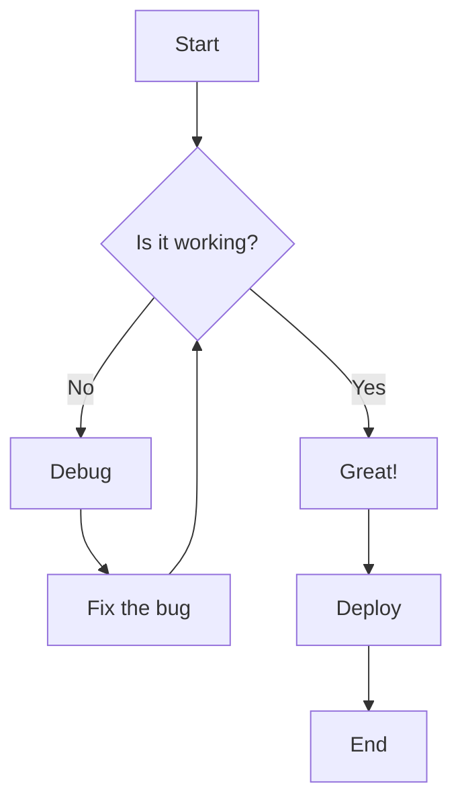
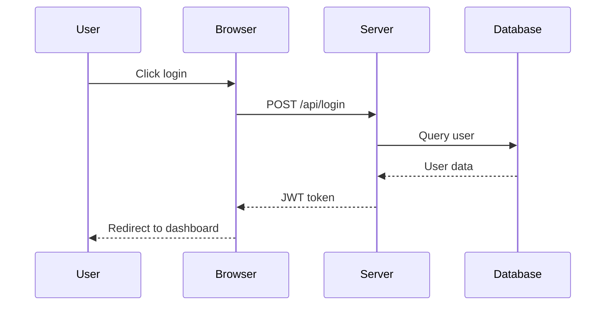
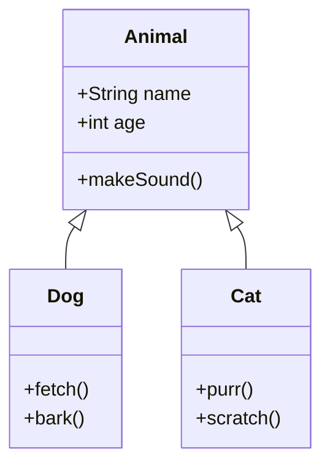
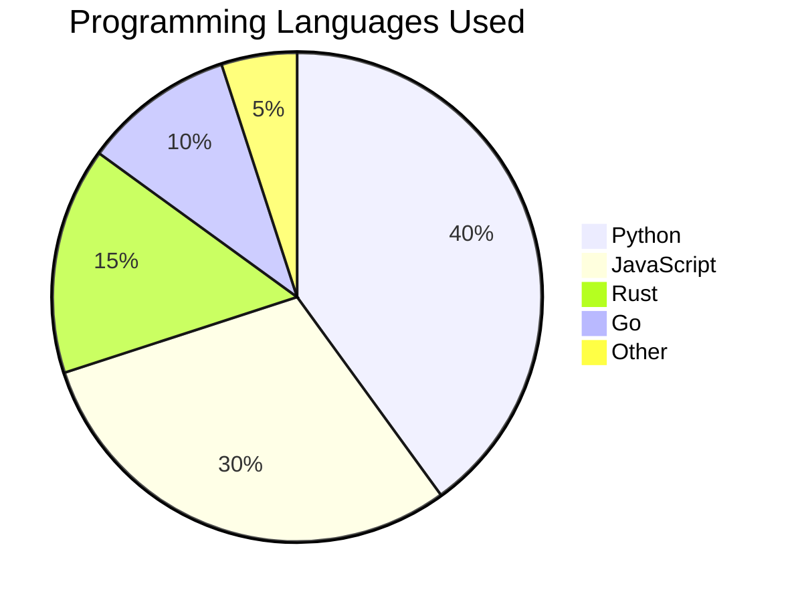

This post demonstrates every third-party library configured in `_config.yml`. Each section shows the front matter flags, the Markdown/HTML syntax, and the rendered result.

---

## 1. MathJax (Global)

MathJax is enabled globally via `enable_math: true`. No front matter needed.

Inline math: $E = mc^2$

Display math:

$$
\int_{-\infty}^{\infty} e^{-x^2} \, dx = \sqrt{\pi}
$$

Numbered equation:

\begin{equation}
\label{eq:cauchy-schwarz}
\left( \sum*{k=1}^n a_k b_k \right)^2 \leq \left( \sum*{k=1}^n a*k^2 \right) \left( \sum*{k=1}^n b_k^2 \right)
\end{equation}

Matrix:

$$
\mathbf{A} = \begin{pmatrix} a_{11} & a_{12} & \cdots & a_{1n} \\ a_{21} & a_{22} & \cdots & a_{2n} \\ \vdots & \vdots & \ddots & \vdots \\ a_{n1} & a_{n2} & \cdots & a_{nn} \end{pmatrix}
$$

---

## 2. Highlight.js (Global)

Syntax highlighting is enabled globally. Just use fenced code blocks:

```python
def fibonacci(n: int) -> list[int]:
    """Generate first n Fibonacci numbers."""
    fib = [0, 1]
    for i in range(2, n):
        fib.append(fib[-1] + fib[-2])
    return fib[:n]
```

```javascript
const debounce = (fn, delay) => {
  let timer;
  return (...args) => {
    clearTimeout(timer);
    timer = setTimeout(() => fn(...args), delay);
  };
};
```

```rust
fn main() {
    let numbers: Vec<i32> = (1..=10).collect();
    let sum: i32 = numbers.iter().sum();
    println!("Sum of 1 to 10: {}", sum);
}
```

---

## 3. Mermaid Diagrams

**Front matter:** `mermaid: {enabled: true, zoomable: true}`

The `zoomable: true` flag also loads D3 for pan/zoom on diagrams.

### Flowchart



### Sequence Diagram



### Class Diagram



### Pie Chart



---

## 4. Chart.js

**Front matter:** `chart: {chartjs: true}`

Use a code block with language `chartjs` containing valid Chart.js JSON config:

```chartjs
{
  "type": "bar",
  "data": {
    "labels": ["Python", "JavaScript", "Rust", "Go", "TypeScript", "C++"],
    "datasets": [{
      "label": "GitHub Stars (thousands)",
      "data": [45, 38, 22, 15, 18, 12],
      "backgroundColor": [
        "rgba(54, 162, 235, 0.7)",
        "rgba(255, 206, 86, 0.7)",
        "rgba(255, 99, 132, 0.7)",
        "rgba(75, 192, 192, 0.7)",
        "rgba(153, 102, 255, 0.7)",
        "rgba(255, 159, 64, 0.7)"
      ],
      "borderColor": [
        "rgba(54, 162, 235, 1)",
        "rgba(255, 206, 86, 1)",
        "rgba(255, 99, 132, 1)",
        "rgba(75, 192, 192, 1)",
        "rgba(153, 102, 255, 1)",
        "rgba(255, 159, 64, 1)"
      ],
      "borderWidth": 1
    }]
  },
  "options": {
    "scales": {
      "y": {
        "beginAtZero": true
      }
    }
  }
}
```

### Chart.js Line Chart

```chartjs
{
  "type": "line",
  "data": {
    "labels": ["Jan", "Feb", "Mar", "Apr", "May", "Jun"],
    "datasets": [{
      "label": "Site Visitors",
      "data": [1200, 1900, 3000, 5000, 4200, 6800],
      "fill": true,
      "borderColor": "rgb(75, 192, 192)",
      "backgroundColor": "rgba(75, 192, 192, 0.2)",
      "tension": 0.3
    }]
  },
  "options": {
    "scales": {
      "y": {
        "beginAtZero": true
      }
    }
  }
}
```

---

## 5. ECharts

**Front matter:** `chart: {echarts: true}`

Use a code block with language `echarts` containing valid ECharts option JSON:

### Bar Chart

```echarts
{
  "xAxis": {
    "type": "category",
    "data": ["Mon", "Tue", "Wed", "Thu", "Fri", "Sat", "Sun"]
  },
  "yAxis": {
    "type": "value"
  },
  "series": [{
    "data": [150, 230, 224, 218, 135, 147, 260],
    "type": "bar",
    "showBackground": true,
    "backgroundStyle": {
      "color": "rgba(180, 180, 180, 0.2)"
    }
  }],
  "title": {
    "text": "Weekly Activity"
  },
  "tooltip": {
    "trigger": "axis"
  }
}
```

### Pie Chart

```echarts
{
  "title": {
    "text": "Tech Stack Distribution",
    "left": "center"
  },
  "tooltip": {
    "trigger": "item"
  },
  "series": [{
    "name": "Technology",
    "type": "pie",
    "radius": "50%",
    "data": [
      {"value": 1048, "name": "Search Engine"},
      {"value": 735, "name": "Direct"},
      {"value": 580, "name": "Email"},
      {"value": 484, "name": "Social Media"},
      {"value": 300, "name": "Referral"}
    ],
    "emphasis": {
      "itemStyle": {
        "shadowBlur": 10,
        "shadowOffsetX": 0,
        "shadowColor": "rgba(0, 0, 0, 0.5)"
      }
    }
  }]
}
```

---

## 6. Plotly

**Front matter:** `chart: {plotly: true}`

Use a code block with language `plotly` containing `{data: [...], layout: {...}}`:

### Bar Chart

```plotly
{
  "data": [
    {
      "x": ["AI/ML", "Web Dev", "Systems", "Data Science", "DevOps"],
      "y": [85, 72, 60, 78, 45],
      "type": "bar",
      "marker": {
        "color": ["#636efa", "#EF553B", "#00cc96", "#ab63fa", "#FFA15A"]
      }
    }
  ],
  "layout": {
    "title": "Skill Proficiency (%)",
    "xaxis": {"title": "Domain"},
    "yaxis": {"title": "Proficiency", "range": [0, 100]}
  }
}
```

### Scatter Plot

```plotly
{
  "data": [
    {
      "x": [1, 2, 3, 4, 5, 6, 7, 8, 9, 10],
      "y": [2, 4, 5, 7, 6, 8, 9, 10, 12, 11],
      "mode": "markers",
      "type": "scatter",
      "name": "Experiment A",
      "marker": {"size": 10, "color": "#636efa"}
    },
    {
      "x": [1, 2, 3, 4, 5, 6, 7, 8, 9, 10],
      "y": [1, 3, 4, 6, 8, 7, 10, 11, 9, 13],
      "mode": "lines+markers",
      "type": "scatter",
      "name": "Experiment B",
      "marker": {"size": 10, "color": "#EF553B"}
    }
  ],
  "layout": {
    "title": "Experiment Comparison",
    "xaxis": {"title": "Time"},
    "yaxis": {"title": "Value"}
  }
}
```

---

## 7. Vega-Lite

**Front matter:** `chart: {vega_lite: true}`

Use a code block with language `vega_lite` containing a Vega-Lite spec:

```vega_lite
{
  "$schema": "https://vega.github.io/schema/vega-lite/v5.json",
  "description": "A simple bar chart",
  "data": {
    "values": [
      {"a": "C", "b": 43},
      {"a": "C++", "b": 12},
      {"a": "Go", "b": 15},
      {"a": "Java", "b": 35},
      {"a": "JS", "b": 38},
      {"a": "Python", "b": 45},
      {"a": "Rust", "b": 22},
      {"a": "TS", "b": 18}
    ]
  },
  "mark": {"type": "bar", "tooltip": true},
  "encoding": {
    "x": {"field": "a", "type": "nominal", "title": "Language", "sort": "-y"},
    "y": {"field": "b", "type": "quantitative", "title": "Stars (thousands)"},
    "color": {"field": "a", "type": "nominal", "legend": null}
  }
}
```

---

## 8. Leaflet Maps

**Front matter:** `map: true`

Use a code block with language `geojson` containing valid GeoJSON:

```geojson
{
  "type": "FeatureCollection",
  "features": [
    {
      "type": "Feature",
      "properties": {
        "name": "Hanoi"
      },
      "geometry": {
        "type": "Point",
        "coordinates": [
          105.85,
          21.03
        ]
      }
    },
    {
      "type": "Feature",
      "properties": {
        "name": "Ho Chi Minh City"
      },
      "geometry": {
        "type": "Point",
        "coordinates": [
          106.63,
          10.82
        ]
      }
    },
    {
      "type": "Feature",
      "properties": {
        "name": "Da Nang"
      },
      "geometry": {
        "type": "Point",
        "coordinates": [
          108.21,
          16.07
        ]
      }
    }
  ]
}
```

---

## 9. Diff2HTML

**Front matter:** `code_diff: true`

Use a code block with language `diff2html` containing a unified diff:

```diff2html
--- a/src/utils.js
+++ b/src/utils.js
@@ -1,8 +1,12 @@
-function add(a, b) {
-  return a + b;
+function add(...numbers) {
+  return numbers.reduce((sum, n) => sum + n, 0);
 }

-function multiply(a, b) {
-  return a * b;
+function multiply(...numbers) {
+  return numbers.reduce((product, n) => product * n, 1);
 }
+
+function average(...numbers) {
+  return add(...numbers) / numbers.length;
+}
```

---

## 10. Bootstrap Table

**Front matter:** `pretty_table: true`

### Simple Markdown Table

| Library  | Version |        Purpose |
| :------- | :-----: | -------------: |
| MathJax  |  3.2.2  | Math rendering |
| Mermaid  | 10.7.0  |       Diagrams |
| Chart.js |  4.4.1  |         Charts |
| Leaflet  |  1.9.4  |           Maps |
| D3       |  7.8.5  |  Visualization |

### Interactive Table (from JSON data)

This table loads data from `assets/json/libraries_demo_data.json` with search, sort, and pagination:



```html
<table
  data-toggle="table"
  data-url="{{ '/assets/json/libraries_demo_data.json' | relative_url }}"
  data-pagination="true"
  data-search="true"
  data-page-size="10"
>
  <thead>
    <tr>
      <th data-field="id" data-sortable="true">ID</th>
      <th data-field="name" data-sortable="true">Name</th>
      <th data-field="type" data-sortable="true">Type</th>
      <th data-field="version" data-sortable="true">Version</th>
      <th data-field="license">License</th>
    </tr>
  </thead>
</table>
```



<table
  data-toggle="table"
  data-url="{{ '/assets/json/libraries_demo_data.json' | relative_url }}"
  data-pagination="true"
  data-search="true"
  data-page-size="10"
>
  <thead>
    <tr>
      <th data-field="id" data-sortable="true">ID</th>
      <th data-field="name" data-sortable="true">Name</th>
      <th data-field="type" data-sortable="true">Type</th>
      <th data-field="version" data-sortable="true">Version</th>
      <th data-field="license">License</th>
    </tr>
  </thead>
</table>

---

## 11. Pseudocode

**Front matter:** `pseudocode: true`

Use a code block with language `pseudocode` containing LaTeX-style algorithm pseudocode:

```pseudocode
\begin{algorithm}
\caption{Quicksort}
\begin{algorithmic}
\PROCEDURE{Quicksort}{$A, lo, hi$}
  \IF{$lo < hi$}
    \STATE $p \gets$ \CALL{Partition}{$A, lo, hi$}
    \CALL{Quicksort}{$A, lo, p - 1$}
    \CALL{Quicksort}{$A, p + 1, hi$}
  \ENDIF
\ENDPROCEDURE
\PROCEDURE{Partition}{$A, lo, hi$}
  \STATE $pivot \gets A[hi]$
  \STATE $i \gets lo - 1$
  \FOR{$j \gets lo$ \TO $hi - 1$}
    \IF{$A[j] < pivot$}
      \STATE $i \gets i + 1$
      \STATE \CALL{Swap}{$A[i], A[j]$}
    \ENDIF
  \ENDFOR
  \STATE \CALL{Swap}{$A[i + 1], A[hi]$}
  \STATE \RETURN $i + 1$
\ENDPROCEDURE
\end{algorithmic}
\end{algorithm}
```

---

## 12. Medium Zoom (Global)

**Config:** `enable_medium_zoom: true` (already enabled globally)

Images with the `data-zoomable` attribute can be clicked to zoom:







---

## 13. Image Comparison Slider

**Front matter:** `images: {compare: true}`

Use the `` HTML element:

```html

  
  
</img-comparison-slider>
```

Below is a demo using the same image as both sides (replace with your own before/after images):


  
  
</img-comparison-slider>

---

## 14. Lightbox2

**Front matter:** `images: {lightbox2: true}`

Wrap images in `<a>` tags with `data-lightbox` to create a gallery:

```html
<a href="image.jpg" data-lightbox="gallery" data-title="Caption">
  
</a>
```

Demo:

<a href="{{ '/assets/img/avt.webp' | relative_url }}" data-lightbox="demo-gallery" data-title="Lightbox2 Demo Image">
  
</a>

---

## 15. PhotoSwipe

**Front matter:** `images: {photoswipe: true}`

PhotoSwipe requires a specific HTML structure with `data-pswp-src` and `data-pswp-width`/`data-pswp-height`:

```html
<div class="pswp-gallery" id="gallery">
  <a href="image.jpg" data-pswp-src="image.jpg" data-pswp-width="800" data-pswp-height="600">
    
  </a>
</div>
```

Demo:

<div class="pswp-gallery" id="photoswipe-demo">
  <a href="{{ '/assets/img/avt.webp' | relative_url }}" data-pswp-src="{{ '/assets/img/avt.webp' | relative_url }}" data-pswp-width="800" data-pswp-height="800" target="_blank">
    
  </a>
</div>

---

## 16. Swiper (Image Slider/Carousel)

**Front matter:** `images: {slider: true}`

Use the Swiper web component:

```html
<swiper-container slides-per-view="1" navigation="true" pagination="true">
  <swiper-slide></swiper-slide>
  <swiper-slide></swiper-slide>
</swiper-container>
```

Demo:

<swiper-container slides-per-view="1" navigation="true" pagination="true" loop="true">
  <swiper-slide>
    
  </swiper-slide>
  <swiper-slide>
    
  </swiper-slide>
  <swiper-slide>
    
  </swiper-slide>
</swiper-container>

---

## 17. Spotlight

**Front matter:** `images: {spotlight: true}`

Spotlight provides a minimal lightbox. Wrap images in `<a>` tags:

```html
<a href="image.jpg" data-spotlight>
  
</a>
```

Demo:

<a href="{{ '/assets/img/avt.webp' | relative_url }}" data-spotlight>
  
</a>

---

## 18. VenoBox

**Front matter:** `images: {venobox: true}`

VenoBox auto-initializes on elements with `data-venbox` or `data-gall`:

```html
<a href="image.jpg" data-gall="gallery" class="venobox">
  
</a>
```

Demo:

<a href="{{ '/assets/img/avt.webp' | relative_url }}" data-gall="venobox-demo" class="venobox">
  
</a>

---

## 19. D3 (loaded with Mermaid)

**Front matter:** `mermaid: {enabled: true, zoomable: true}`

D3 is loaded automatically when `zoomable: true` is set on mermaid. It enables pan and zoom on mermaid diagrams. The flowchart in the Mermaid section above supports zoom via D3.

---

## 20. jQuery & MDB (Global)

jQuery and MDB (Material Design Bootstrap) are loaded on every page. They power Bootstrap components, DOM manipulation, and Material Design styles used throughout the site. No special front matter needed.

---

## 21. Masonry & ImagesLoaded (Global)

**Config:** `enable_masonry: true` (already enabled globally)

Masonry is used for the project cards layout on the projects page. ImagesLoaded ensures images are loaded before the grid is arranged. No special usage in posts — it powers the `projects.liquid` include automatically.

---

## 22. Progress Bar (Global)

**Config:** `enable_progressbar: true` (already enabled globally)

The horizontal progress bar at the top of the page tracks scroll position. It is visible on every page automatically. Scroll down to see it in action.

---

## 23. Google Fonts (Global)

**Config:** Always loaded.

The site uses **Roboto** (body), **Roboto Slab** (headings), and **Material Icons** from Google Fonts. These are loaded automatically on every page.

---

## 24. Polyfill (Global)

Loaded alongside MathJax to ensure ES6+ compatibility in older browsers. No special usage needed.

---

## Summary: Front Matter Cheat Sheet

To enable all libraries in a single post, use this front matter:

```yaml
---
layout: post
title: "Your Post Title"
date: 2026-05-30 12:00:00
pretty_table: true # Bootstrap Table
mermaid:
  enabled: true # Mermaid diagrams
  zoomable: true # D3 zoom on mermaid
code_diff: true # Diff2HTML
map: true # Leaflet maps
chart:
  chartjs: true # Chart.js
  echarts: true # ECharts
  plotly: true # Plotly
  vega_lite: true # Vega-Lite
pseudocode: true # Pseudocode rendering
images:
  compare: true # Image comparison slider
  lightbox2: true # Lightbox2 gallery
  photoswipe: true # PhotoSwipe gallery
  slider: true # Swiper carousel
  spotlight: true # Spotlight lightbox
  venobox: true # VenoBox lightbox
---
```

Libraries that are **always active** (no front matter needed): MathJax, Highlight.js, Medium Zoom, Masonry, jQuery, MDB, Google Fonts, Progress Bar, Back to Top.
