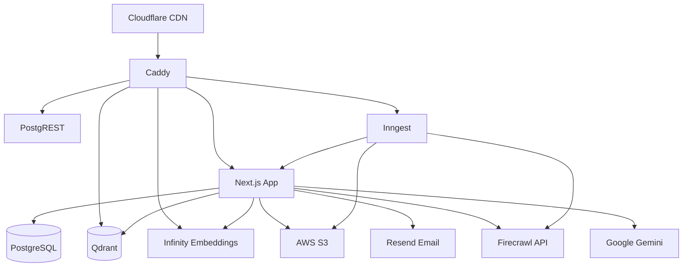
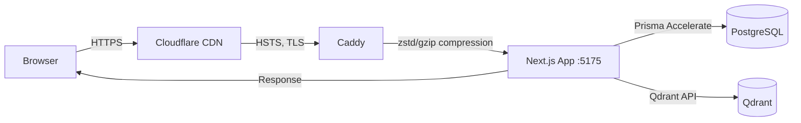
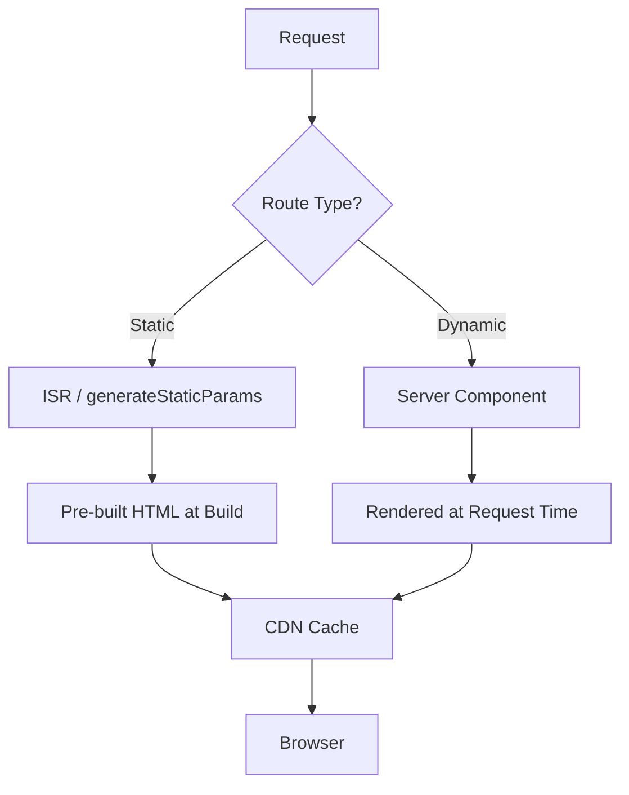
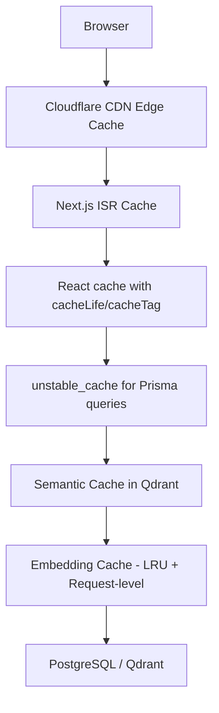
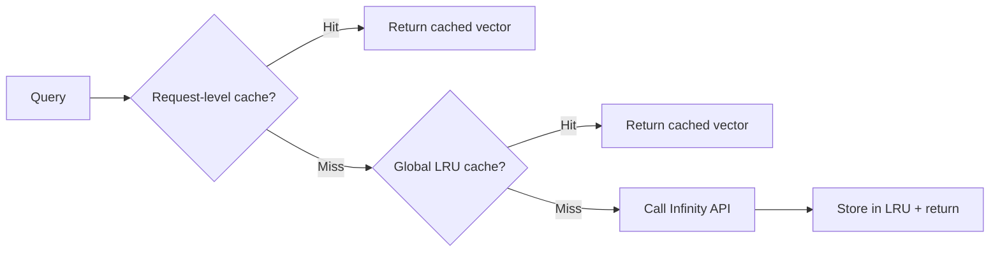
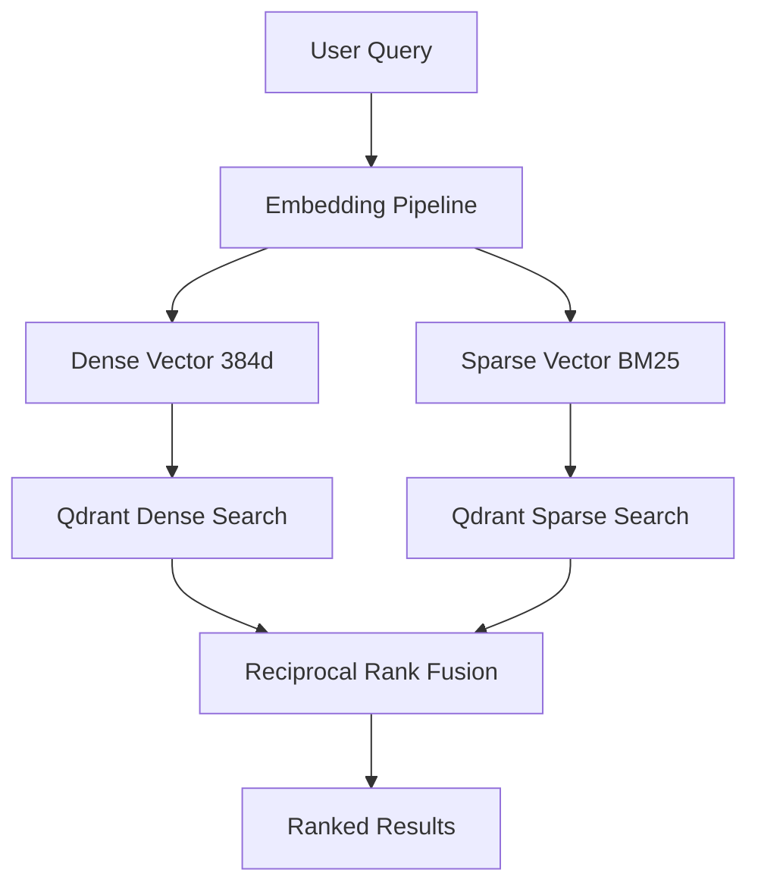
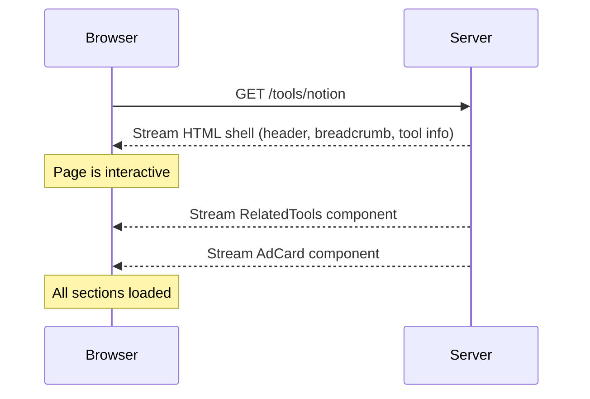
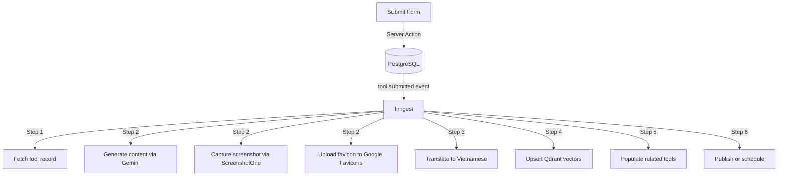

## The Problem

Students and staff at VinUniversity needed a way to discover AI-powered tools for work and study. The AI tool landscape is fragmented — hundreds of tools across writing, coding, research, and productivity, with no centralized, curated directory tailored to an academic community.

Existing solutions like There's An AI For That or Futurepedia are massive, unfiltered catalogs. They lack semantic understanding of queries, offer no conversational guidance, and provide no bilingual support for non-English-speaking communities.

The goal was clear: build a directory that lets users find the right AI tool through browsing, semantic search, and natural language conversation — all with English and Vietnamese support.

## Background

### Why Keyword Search Isn't Enough

Traditional keyword search fails on semantic queries. Searching "note taking" won't match tools described as "knowledge management" or "second brain." Searching "write better essays" won't surface grammar checkers or AI writing assistants unless those exact words appear in the metadata.

The solution is hybrid search — combining dense vector embeddings (semantic understanding) with sparse BM25 vectors (exact keyword matching), fused via Reciprocal Rank Fusion (RRF). This captures both meaning and precision.

### Why a Chat Interface?

Even with great search, users don't always know what to search for. A conversational interface lowers the barrier: "What's a good alternative to Notion for students?" or "Compare Obsidian and Logseq for research notes." These are natural questions that require retrieval-augmented generation (RAG) — fetching relevant tools from the database and grounding LLM responses in real data.

## What I Built

AI Knowledge Cloud (aikc) is a bilingual English/Vietnamese directory of AI-powered work and study tools. It provides:



- **Tool directory** with category, collection, and tag filtering
- **Hybrid semantic + keyword search** powered by Qdrant
- **AI chat assistant** with RAG context injection and semantic caching
- **Automated tool submission pipeline** with AI content generation, screenshot capture, and vector indexing
- **Admin dashboard** for full CRUD management
- **Bilingual content** with machine translation to Vietnamese



---

## Technology Deep Dive

### Tech Stack

| Layer           | Technology                                               |
| --------------- | -------------------------------------------------------- |
| Runtime         | Bun                                                      |
| Framework       | Next.js 15 App Router, React 19                          |
| Database        | PostgreSQL (Neon) with Prisma ORM                        |
| Vector DB       | Qdrant (hybrid dense + sparse search)                    |
| Embeddings      | Infinity (local, sentence-transformers/all-MiniLM-L6-v2) |
| AI              | Vercel AI SDK with Google Gemini                         |
| Background jobs | Inngest                                                  |
| Styling         | Tailwind CSS, Shadcn UI + Radix                          |
| Storage         | AWS S3 for images                                        |
| Email           | Resend                                                   |
| Reverse proxy   | Caddy with Cloudflare                                    |

The entire stack runs on a single VPS via Docker Compose with seven services: PostgreSQL, Qdrant, Infinity embeddings, Inngest, the Next.js app, PostgREST, and Caddy.

### Why These Choices?

**Bun over Node.js** — faster install times, built-in TypeScript support, and native bundler. The entire project has zero build-tool config files.

**Qdrant over Pinecone/Weaviate** — self-hosted, supports hybrid dense + sparse collections natively, and has a clean REST API. Running locally means no external API costs for vector search.

**Infinity over OpenAI embeddings** — local embedding server using `sentence-transformers/all-MiniLM-L6-v2` (384 dimensions). No API key required, no latency to external services, no cost per embedding.

**Inngest over Bull/Agenda** — durable execution with step-level retries, event-driven triggers, and a built-in dashboard. Each step in the pipeline can retry independently without restarting the entire job.

## Architecture

### High-Level Architecture



Caddy serves as the reverse proxy, routing requests to the appropriate service. Cloudflare handles CDN and DDoS protection. The Next.js app is the central hub, connecting to PostgreSQL for structured data, Qdrant for vector search, and external APIs for AI and storage.

### Request Flow Architecture

Every request passes through a layered pipeline optimized for different concerns:



**Layer 1 — Cloudflare CDN**: Handles TLS termination, DDoS protection, and edge caching. The `Strict-Transport-Security` header with `max-age=63072000; includeSubDomains; preload` is set both at Cloudflare and in the Caddyfile for defense in depth.



**Layer 2 — Caddy reverse proxy**: Applies zstd/gzip compression, security headers (X-Frame-Options DENY, X-Content-Type-Options nosniff, COOP same-origin, CORP same-origin), and blocks direct IP access. Only requests with a matching `Host` header (`aikc.vn`) are forwarded. Cloudflare's IP ranges are in `trusted_proxies` so the app sees the real client IP via `CF-Connecting-IP`.

**Layer 3 — Next.js App Router**: Server components render on the server, Prisma queries hit PostgreSQL via Prisma Accelerate (connection pooling), and vector searches hit Qdrant. The response is streamed back through Caddy with compression.

### Docker Compose Service Topology

| Service     | Image                          | Purpose                                                |
| ----------- | ------------------------------ | ------------------------------------------------------ |
| `postgres`  | postgres:17-alpine             | Primary database with pg_trgm and citext extensions    |
| `qdrant`    | qdrant/qdrant:v1.16.1          | Vector database for hybrid search and caching          |
| `infinity`  | michaelf34/infinity:latest-cpu | Local embedding server (all-MiniLM-L6-v2)              |
| `inngest`   | inngest/inngest                | Background job runner with event-driven triggers       |
| `app`       | aikc-local-app                 | Next.js application (standalone output)                |
| `postgrest` | postgrest/postgrest            | REST API for PostgreSQL (internal only)                |
| `caddy`     | caddy:2-alpine                 | Reverse proxy with compression and security headers    |
| `migrate`   | (one-shot)                     | Runs Prisma db push at startup                         |
| `build`     | (one-shot)                     | Runs next build with live database for cacheComponents |

The Dockerfile uses a two-stage build. Critically, `next build` does **not** run during `docker build` because `cacheComponents` requires `generateStaticParams` to query the live database. Instead, a separate `build` service runs `next build` at compose startup time, after the database is ready.

---

## Server-Side Rendering (SSR) and Static Generation

### The Rendering Strategy

AI Knowledge Cloud uses a hybrid rendering approach that maximizes static generation while keeping dynamic content fresh:



**Static routes** (`generateStaticParams`): Tool detail pages, category pages, collection pages, and tag pages are statically generated at build time. The `generateStaticParams` function queries PostgreSQL for all slugs and pre-renders each page:

```typescript
export const generateStaticParams = async () => {
  if (!process.env.DATABASE_URL) return [];
  try {
    const tools = await findToolSlugs({});
    return tools.map(({ slug }) => ({ slug }));
  } catch {
    return [];
  }
};
```

This means every tool page (`/tools/notion`, `/tools/obsidian`, etc.) is a pre-built HTML file served directly by the CDN. No database query happens at request time for these pages.

**Dynamic routes** (`/tools` listing with search params): The tool listing page accepts query parameters (`q`, `category`, `collection`, `pricing`, `sort`, `page`) that drive dynamic filtering. These are parsed via `nuqs` (URL query state management) and resolved at request time in server components.

### React Server Components (RSC) by Default

Every page component is a server component by default. This means:

- **Zero client-side JavaScript** for pages that don't need interactivity
- **Direct database access** from the component (Prisma queries run on the server)
- **Streaming HTML** — the shell renders immediately while data-dependent sections load via Suspense

Client components are minimized and wrapped in Suspense boundaries:

```typescript
// Server component — renders on the server, no JS shipped to client
export default async function ToolPage({ params }: PageProps) {
  const tool = await getTool(slug); // Prisma query runs on server

  return (
    <>
      <JsonLd data={buildSoftwareApplicationSchema(tool)} />
      {/* ... server-rendered content ... */}

      {/* Client component wrapped in Suspense for streaming */}
      <Suspense fallback={<RelatedToolsSkeleton />}>
        <RelatedTools locale={locale} tool={tool} />
      </Suspense>
    </>
  );
}
```



````

### The `cacheComponents` Flag

Next.js 15's `cacheComponents: true` in `next.config.ts` enables component-level caching. When enabled, `generateStaticParams` must query the live database at build time — which is why the Docker Compose setup runs `next build` as a separate service after PostgreSQL is ready, not during `docker build`.

### Bilingual Routing with Locale-Aware Rendering

All public routes are locale-aware (`/[locale]/tools`, `/[locale]/categories`, etc.). The locale is extracted from the URL path and used to resolve bilingual content:

```typescript
const isVietnamese = locale === "vi";
const name = isVietnamese ? (tool.nameVi ?? tool.name) : tool.name;
const tagline = isVietnamese ? (tool.taglineVi ?? tool.tagline) : tool.tagline;
````

The fallback chain (`tool.nameVi ?? tool.name`) ensures pages always render, even if Vietnamese translations are missing. Translation status is tracked per entity via `translationStatusVi` (enum: `MISSING`, `MACHINE`, `REVIEWED`).

---

## Caching Architecture

The application implements a multi-layered caching strategy that spans from the CDN edge to the application's internal state:



### Layer 1: CDN and HTTP Caching

Static assets get aggressive caching via Next.js headers:

```typescript
// next.config.ts
{
  source: "/:all*(svg|jpg|jpeg|png|gif|ico|webp|avif)",
  headers: [{ key: "Cache-Control", value: "public, max-age=31536000, immutable" }],
},
{
  source: "/_next/static/:path*",
  headers: [{ key: "Cache-Control", value: "public, max-age=31536000, immutable" }],
},
```

Images, fonts, and Next.js static chunks are cached for 1 year with the `immutable` directive. The Next.js `<Image>` component serves AVIF/WebP formats with responsive `deviceSizes` (640–3840px) and `imageSizes` (16–384px), with a 1-year minimum cache TTL.

### Layer 2: React `cacheLife` and `cacheTag`

Next.js 15 introduces `"use cache"` with `cacheLife` and `cacheTag` for fine-grained component-level caching. Tool detail pages use this pattern:

```typescript
const getTool = async (slug: string) => {
  "use cache";
  cacheLife("max");
  cacheTag("tools");
  return findUniqueTool({ where: { slug } });
};
```

- **`cacheLife("max")`** — the cached value persists as long as possible
- **`cacheTag("tools")`** — the cache can be invalidated by calling `revalidateTag("tools")`

When an admin updates a tool, the server action calls `revalidatePath("/admin/tools")` and `revalidatePath(/admin/tools/${tool.slug})`, which invalidates the relevant cached components. The sitemap uses `cacheLife("hours")` with `cacheTag("tools", "categories", "collections", "tags")` to stay reasonably fresh.

### Layer 3: `unstable_cache` for Database Queries

Admin dashboard stats and ad queries use `unstable_cache` for query-level caching:

```typescript
const getStats = unstable_cache(
  async () => {
    const [tools, categories, collections, tags] = await Promise.all([
      prisma.tool.count(),
      prisma.category.count(),
      prisma.collection.count(),
      prisma.tag.count(),
    ]);
    return { tools, categories, collections, tags };
  },
  ["admin-stats"],
  { revalidate: 60 } // 60-second TTL
);
```

Ad queries use a 5-minute revalidation window. When ads are created, updated, or deleted, the server action calls `revalidateTag("ads", "max")` to bust the cache immediately.

### Layer 4: Semantic Cache in Qdrant

The AI chat system caches responses in Qdrant's `semantic_cache` collection. This is not a traditional key-value cache — it uses vector similarity to detect near-duplicate queries:

```typescript
const results = await qdrantClient.search(QDRANT_SEMANTIC_CACHE_COLLECTION, {
  vector, // embedding of the normalized question
  limit: 1,
  with_payload: true,
  score_threshold: 0.92, // 92% similarity required for a cache hit
  filter: toolSlug ? { must: [{ key: "toolSlug", match: { value: toolSlug } }] } : undefined,
});
```

The lookup flow:

1. Normalize the query (trim, collapse whitespace, lowercase)
2. Generate a 384-dimensional embedding via Infinity
3. Search Qdrant with `score_threshold = 0.92`
4. If `toolSlug` is set, first search with a tool-scoped filter. If no match, retry without the filter (global fallback)
5. Reject hits where the cached answer is effectively empty

A separate `search_cache_memory` collection stores search results with `on_disk: false` (vectors forced to RAM) for maximum lookup speed. This collection has a 1-week TTL and version-aware invalidation (`cacheVersion` field).

### Layer 5: Embedding Cache (Two-Tier)

Every query that needs an embedding goes through a two-tier cache:



**Request-level deduplication**: Uses `AsyncLocalStorage` to deduplicate identical embedding requests within a single server action. If the same query text is used for both tools and categories search, the embedding is generated once.

**Global LRU cache**: In-memory cache with 1,000 entries and a 3-day TTL. The cache key is `normalizedQuery::model::dimensions`.

```typescript
export const getCachedEmbedding = async (
  keyInput: EmbeddingCacheKeyInput,
  loader: () => Promise<number[]>,
  config: EmbeddingCacheConfig
): Promise<EmbeddingCacheResult> => {
  const cacheKey = buildCacheKey(keyInput);

  // Check request-level cache first (zero-latency)
  const requestCache = requestStore.getStore();
  const requestHit = requestCache?.get(cacheKey);
  if (requestHit) {
    const vector = await requestHit;
    return { vector, cacheKey, fromCache: true, source: "request" };
  }

  // Check global LRU cache
  const existing = lruCache.get(cacheKey);
  if (existing && existing.expiresAt > Date.now()) {
    lruCache.delete(cacheKey);
    lruCache.set(cacheKey, existing); // refresh LRU order
    return { vector: existing.value, cacheKey, fromCache: true, source: "global" };
  }

  // Cache miss — call Infinity and store
  const vector = await loader();
  lruCache.set(cacheKey, { value: vector, expiresAt: Date.now() + config.ttlMs, createdAt: Date.now() });
  return { vector, cacheKey, fromCache: false, source: "global" };
};
```

---

## RAG (Retrieval-Augmented Generation)

The RAG pipeline grounds LLM responses in real tool data from the database. It uses a "Route, Transform, Retrieve" architecture that classifies intent before retrieval:

### The Fused Query Router

Instead of multiple sequential LLM calls (classify intent, then extract metadata, then expand query), the fused query router does everything in a **single LLM call** using Google Gemini Flash Lite with structured output:

```typescript
const { object } = await generateObject({
  model: googleFlashLiteModel,
  schema: FusedQueryResultSchema, // Zod schema for structured output
  temperature: 0,
  system: `You are a fused query router for an AI Work & Study tools directory.
For each user query, you MUST:
- Decide the primary intent: "recommendation", "comparison", or "search".
- Provide a confidence score between 0 and 1.
- Explain your reasoning briefly.
Then, depending on the chosen intent:
1. recommendation: Populate expandedKeywords with 3-8 short keyword phrases.
2. comparison: Populate toolNames with exact tool names being compared.
3. search: Set specificToolName, categories, features, pricing if mentioned.`,
  prompt: `Analyze this user query and return a single fused result:\n\n"${query}"`,
});
```

The router returns a `FusedQueryResult` containing:

- **intent**: `search` | `comparison` | `recommendation`
- **confidence**: 0–1 score
- **toolNames**: extracted tool names (for comparisons)
- **expandedKeywords**: synonym/related terms (for recommendations)
- **categories**, **features**, **pricing**: extracted filters (for search)

A **fast-track path** skips the LLM entirely for simple list/show queries (fewer than 5 words containing "list" or "show"). This saves ~200ms of LLM latency for the most common query pattern.

### Retrieval Strategy by Intent

Each intent maps to a different retrieval strategy:

| Intent           | Strategy                                                                                  | Example Query                        |
| ---------------- | ----------------------------------------------------------------------------------------- | ------------------------------------ |
| `search`         | Hybrid search with optional category filter; exact name lookup if specific tool mentioned | "What is Notion?"                    |
| `comparison`     | Extract tool names, search by name, fill gaps with hybrid search                          | "Compare Obsidian and Logseq"        |
| `recommendation` | Expand query with keywords from router, then hybrid search                                | "Best note-taking apps for students" |

For **comparison** queries, the system first tries exact name matching via `searchToolsByName()`, then falls back to hybrid search for any tools not found by name. This ensures "Compare Notion and Obsidian" returns exactly those two tools, not semantically similar ones.

For **recommendation** queries, the router expands the query with 3–8 related keywords. "Best note-taking apps" becomes "best note-taking apps, knowledge management, writing tools, personal wiki, second brain, productivity" — dramatically improving recall.

### Intent-Aware Answer Generation

The system prompt changes based on the classified intent:

```typescript
switch (intent.intent) {
  case "comparison":
    systemPrompt = `You are a research assistant comparing Work & Study tools.
Provide a structured comparison. Create a clear comparison table if appropriate.`;
    break;
  case "recommendation":
    systemPrompt = `You are a research assistant recommending Work & Study tools.
Explain why each tool is a good fit for their use case.`;
    break;
  default:
    systemPrompt = `You are a research assistant that answers questions about Work & Study tools.
Cite the tool slug inline whenever you reference it.`;
}
```

The retrieved context includes full tool metadata (name, tagline, description, content, categories, tags) formatted as numbered snippets. The LLM generates an answer grounded in this context, with inline slug citations.



### Post-Stream Caching

After the LLM response streams to the client, the answer and context are stored in the semantic cache for future reuse:

```typescript
void storeCachedAnswer({
  question,
  answer: text,
  context,
  toolSlug,
  toolResults,
});
```

The `void` keyword means the cache write is fire-and-forget — it doesn't block the response. If the write fails, the user still gets their answer; they just won't benefit from caching next time.

---

## Local Embeddings with Infinity

### Why Local Embeddings?

Most vector search implementations rely on external embedding APIs (OpenAI, Cohere, etc.). Each API call adds latency (~100–300ms), costs money per token, and creates a dependency on a third-party service. For a tool directory with ~500 tools, this is overkill.

AI Knowledge Cloud runs **Infinity** — a self-hosted embedding server using `sentence-transformers/all-MiniLM-L6-v2`:

| Property   | Value                                                  |
| ---------- | ------------------------------------------------------ |
| Model      | sentence-transformers/all-MiniLM-L6-v2                 |
| Dimensions | 384 (configurable via `INFINITY_EMBEDDING_DIMENSIONS`) |
| Endpoint   | `POST /embeddings` (Infinity v2 native format)         |
| Auth       | None required (local deployment)                       |
| Latency    | ~5ms per embedding (CPU)                               |
| Cost       | $0                                                     |

### How It Works

The Infinity server runs as a Docker container alongside the application. The `services/infinity.ts` client sends embedding requests to the local endpoint:

```typescript
// services/embedding.ts
export const EMBEDDING_MODEL = "sentence-transformers/all-MiniLM-L6-v2";

export const generateEmbedding = async (text: string, options?: { outputDimensionality?: number }): Promise<number[]> => {
  const response = await infinityClient.embeddings({
    input: text,
    model: EMBEDDING_MODEL,
    ...(options?.outputDimensionality && { dimensions: options.outputDimensionality }),
  });
  return response.data[0].embedding;
};
```

### Two-Tier Caching Eliminates Redundant Calls

The embedding cache (described in the caching section above) ensures that identical queries within a single request are embedded once (request-level deduplication via `AsyncLocalStorage`), and frequently queried terms are cached globally for 3 days (LRU cache with 1,000 entries).

This means a search for "note taking tools" generates an embedding once, then reuses it for:

- The tool directory search
- The semantic cache lookup
- The RAG pipeline context retrieval
- Future identical queries for 3 days

---

## Vector Database: Qdrant Hybrid Search

### Why Hybrid Search?

Pure semantic search (dense vectors) captures meaning but misses exact keyword matches. Pure keyword search (BM25) captures exact terms but misses semantic relationships. The hybrid approach combines both:





### BM25 Sparse Embeddings in Pure TypeScript

The BM25 sparse embedding is generated synchronously in pure TypeScript — no external dependencies, no API calls:

```typescript
const SPARSE_VOCAB_SIZE = 30_000;

const generateSparseEmbedding = (text: string): { indices: number[]; values: number[] } => {
  const tokens = tokenize(text);
  const termFreq = new Map<number, number>();

  // Count term frequencies
  for (const token of tokens) {
    const idx = tokenToIndex(token); // hash-based mapping to 0..29999
    termFreq.set(idx, (termFreq.get(idx) || 0) + 1);
  }

  // BM25-style term frequency saturation
  const docLength = tokens.length;
  const avgDocLength = 100;
  const k1 = 1.2;
  const b = 0.75;

  const indices: number[] = [];
  const values: number[] = [];

  for (const [idx, tf] of termFreq) {
    const normalizedTf = (tf * (k1 + 1)) / (tf + k1 * (1 - b + b * (docLength / avgDocLength)));
    indices.push(idx);
    values.push(normalizedTf);
  }

  return { indices, values };
};
```

The tokenizer splits text into lowercase words, removes punctuation, and filters tokens shorter than 2 characters. The hash-based `tokenToIndex` function maps each token to a fixed 30,000-dimensional sparse vector space.

### Qdrant's Prefetch + RRF Fusion API

The hybrid search uses Qdrant's `prefetch` API to run dense and sparse searches in parallel, then fuses the results with Reciprocal Rank Fusion:

```typescript
const results = await qdrantClient.query(QDRANT_HYBRID_COLLECTION, {
  prefetch: [
    {
      query: denseQuery, // 384-dim dense embedding
      using: "dense",
      limit: prefetchLimit, // 20 candidates
      filter,
    },
    {
      query: {
        indices: sparseQuery.indices,
        values: sparseQuery.values,
      },
      using: "sparse",
      limit: prefetchLimit, // 20 candidates
      filter,
    },
  ],
  query: {
    fusion: "rrf", // Reciprocal Rank Fusion
  },
  limit, // Final result count
  offset,
  with_payload: true,
  score_threshold: scoreThreshold,
});
```

RRF merges the two ranked lists by reciprocal rank: `score = 1/(k + rank)` where `k=60` (Qdrant default). A tool ranked #1 in dense search and #3 in sparse search gets a combined score of `1/61 + 1/63 = 0.0322`. This balances semantic relevance with keyword precision.

### Named Vectors for Hybrid Collections

Each hybrid collection has two named vectors:

```typescript
// Created via REST API (JS client doesn't support sparse_vectors config)
await fetch(`${env.QDRANT_URL}/collections/${QDRANT_HYBRID_COLLECTION}`, {
  method: "PUT",
  headers: qdrantJsonHeaders,
  body: JSON.stringify({
    vectors: {
      dense: { size: 384, distance: "Cosine" },
    },
    sparse_vectors: {
      sparse: { modifier: "idf" }, // IDF modifier for BM25
    },
  }),
});
```

The `modifier: "idf"` setting enables inverse document frequency weighting in Qdrant's sparse vector scoring, which improves relevance for rare terms.

### Collection Design

| Collection            | Vectors        | Storage                    | Purpose                          |
| --------------------- | -------------- | -------------------------- | -------------------------------- |
| `tools_hybrid`        | Dense + Sparse | Disk                       | Main tool search with RRF fusion |
| `alternatives_hybrid` | Dense + Sparse | Disk                       | Alternative tool suggestions     |
| `categories_hybrid`   | Dense + Sparse | Disk                       | Category-based search            |
| `semantic_cache`      | Dense only     | Disk                       | Caches AI chat answers           |
| `search_cache_memory` | Dense only     | **RAM** (`on_disk: false`) | Caches search results for speed  |

The `search_cache_memory` collection forces vectors to stay in RAM (`on_disk: false`) for maximum lookup speed. This is appropriate because search cache entries are small and accessed frequently.

### Lazy Collection Initialization

Collections are created lazily on first use via singleton promises:

```typescript
let ensureHybridCollectionPromise: Promise<void> | null = null;

export const ensureHybridCollection = async () => {
  if (!ensureHybridCollectionPromise) {
    ensureHybridCollectionPromise = (async () => {
      const exists = await qdrantClient.collectionExists(QDRANT_HYBRID_COLLECTION);
      if (!exists) {
        // Create collection with dense + sparse vector config
      }
    })();
  }
  return ensureHybridCollectionPromise;
};
```

The singleton pattern ensures that even if multiple concurrent requests try to create the collection, only one creation attempt runs. All subsequent calls await the same promise.

---

## Recommendation System

### Vector-Based Recommendations

The recommendation system uses Qdrant's **recommendation API** to find tools similar to a given tool based on vector similarity:

```typescript
const results = await qdrantClient.query(QDRANT_HYBRID_COLLECTION, {
  query: {
    recommend: {
      positive: [toUUID(toolId)], // Find tools similar to this one
      negative: [], // No negative examples
    },
  },
  using: "dense", // Use dense vectors for semantic similarity
  filter,
  limit: limit + 1, // Request one extra to exclude the source tool
  with_payload: true,
  score_threshold: scoreThreshold, // 0.3 for recommendations (higher than search)
});
```

The recommendation profile uses stricter thresholds than search:

| Parameter        | Search | Recommendation        |
| ---------------- | ------ | --------------------- |
| `limit`          | 10     | 20                    |
| `scoreThreshold` | 0.0    | 0.3                   |
| `prefetchLimit`  | 20     | 30                    |
| `efSearch`       | 64     | 64 (96 in production) |

The 0.3 score threshold filters out weakly related tools, ensuring recommendations are genuinely similar.

### Precomputed Related Tools

During the tool submission pipeline, Inngest precomputes the top 3 related tools and persists their IDs in the database:

```typescript
export const updateToolRelatedTools = async (toolId: string): Promise<string[]> => {
  const relatedResults = await findRelatedTools(toolId, {
    limit: 3,
    scoreThreshold: 0.0,
    publishedOnly: true,
  });

  const relatedToolIds = relatedResults.map((r) => r.tool.id);

  await prisma.tool.update({
    where: { id: toolId },
    data: { relatedTools: relatedToolIds },
  });

  return relatedToolIds;
};
```

The `relatedTools` field is a `String[]` on the `Tool` model (not a foreign key relation). This denormalization avoids a Qdrant query on every tool page view — the related tools are loaded directly from PostgreSQL.

### On-Demand Recommendations via Qdrant

When the precomputed related tools are stale or insufficient, the `RelatedTools` component queries Qdrant in real-time. This component is wrapped in Suspense with a skeleton fallback, so it loads independently of the main tool page content:

```typescript
<Suspense fallback={<RelatedToolsSkeleton title={t("similarToolsLoading")} />}>
  <RelatedTools locale={locale} tool={tool} />
</Suspense>
```

### Batch Recommendations

For administrative operations (e.g., populating related tools for all existing tools), a batch function processes tools in groups of 5:

```typescript
export const findRelatedToolsBatch = async (toolIds: string[], options: FindRelatedToolsOptions = {}): Promise<Map<string, RelatedToolResult[]>> => {
  const BATCH_SIZE = 5;
  for (let i = 0; i < toolIds.length; i += BATCH_SIZE) {
    const batch = toolIds.slice(i, i + BATCH_SIZE);
    const batchResults = await Promise.all(
      batch.map(async (toolId) => {
        const related = await findRelatedTools(toolId, options);
        return { toolId, related };
      })
    );
    // ... accumulate results
  }
};
```

---

## Preloading and Streaming Techniques

### Suspense Boundaries for Progressive Loading

Every data-dependent section is wrapped in a Suspense boundary with a skeleton fallback. This means the page shell renders immediately (header, breadcrumb, tool metadata) while heavier sections load asynchronously:



Key Suspense boundaries in the tool detail page:

| Section            | Fallback                 | Loading Priority |
| ------------------ | ------------------------ | ---------------- |
| Tool metadata      | None (server-rendered)   | Immediate        |
| Screenshot gallery | None (server-rendered)   | Immediate        |
| Related tools      | `<RelatedToolsSkeleton>` | Deferred         |
| Ad sidebar         | None (server-rendered)   | Immediate        |

The skeleton components use Tailwind's `animate-pulse` for a loading shimmer effect that matches the final layout dimensions, preventing layout shift.

### Link Prefetching

Internal links use Next.js's `prefetch` prop to preload target pages on hover:

```typescript
<Link href={`/tools/${tool.slug}`} prefetch>
  {/* Tool card content */}
</Link>
```

This triggers a prefetch of the target page's RSC payload, so navigation feels instant. The `prefetch` prop is used on tool cards, category cards, collection cards, and markdown links.

### Progressive Search (Streaming Results)

The search palette implements a progressive loading pattern:

1. **Immediate**: Return keyword results (fast, no embedding needed)
2. **Parallel**: Start semantic search in background
3. **Update**: Stream semantic results when ready, merging with keyword results
4. **Cache**: Store final merged results in search cache

```typescript
// actions/search.ts
export async function* progressiveSearchPaletteItems(query: string) {
  // Step 1: Immediate keyword results
  const keywordResults = await keywordSearch(query);
  yield { type: "keyword", results: keywordResults };

  // Step 2: Semantic search in parallel
  const semanticResults = await hybridSearch(query);
  yield { type: "semantic", results: semanticResults };
}
```

This gives users instant feedback (keyword results in ~10ms) while better semantic results load (~100ms with embedding).

### Suspense in the Header

Even the header component uses Suspense for locale-aware elements:

```typescript
<Suspense fallback={<div className="size-4" />}>
  <LocaleSwitcher />
</Suspense>
```

This ensures the header renders immediately without waiting for locale resolution.

---

## SEO Techniques

### Static Generation for Crawlability

All public pages are statically generated via `generateStaticParams`, producing pre-built HTML files that search engine crawlers can index without JavaScript execution. This is critical for a tool directory — every tool page must be indexable.

### JSON-LD Structured Data

Every page injects JSON-LD structured data for rich search results:

**Tool pages** inject two schemas:

```typescript
<JsonLd data={buildSoftwareApplicationSchema(tool)} />
<JsonLd data={buildBreadcrumbSchema([
  { name: "Home", url: "/" },
  { name: "Tools", url: "/" },
  { name: primaryCategoryName, url: `/categories/${category.slug}` },
  { name: toolName, url: `/tools/${tool.slug}` },
])} />
```

The `SoftwareApplication` schema includes name, description, URL, application category, and operating system — enabling rich snippets in search results.

**Category pages** inject `FAQPage` schema with pre-written Q&A pairs (from `data/category-faqs.ts`), enabling FAQ rich results.

**The root layout** injects `Organization` and `WebSite` schemas:

```typescript
<JsonLd data={buildOrganizationSchema()} />
<JsonLd data={buildWebSiteSchema()} />
```

The `<JsonLd>` component renders a `<script type="application/ld+json">` tag:

```typescript
export function JsonLd<T extends Thing>({ data }: JsonLdProps<T>) {
  return (
    <script
      type="application/ld+json"
      dangerouslySetInnerHTML={{ __html: JSON.stringify(data) }}
    />
  );
}
```

### Dynamic Metadata Generation

Every page generates metadata via `generateMetadata`:

```typescript
export const generateMetadata = async ({ params }: PageProps): Promise<Metadata> => {
  const { slug, locale } = await params;
  const tool = await getTool(slug);

  const name = isVietnamese ? (tool.nameVi ?? tool.name) : tool.name;
  const tagline = isVietnamese ? (tool.taglineVi ?? tool.tagline) : tool.tagline;
  const description = isVietnamese ? (tool.descriptionVi ?? tool.description) : tool.description;

  return parseMetadata({
    title: `${name}${tagline ? `: ${tagline}` : ""}`,
    description,
    alternates: buildAlternates(locale, url),
    openGraph: { url: buildLocalizedUrl(locale, url) },
  });
};
```

The `alternates` field generates `hreflang` tags for bilingual content, telling search engines about the English and Vietnamese versions of each page.

### Sitemap Generation

The sitemap includes all tools, categories, collections, and tags with localized URLs:

```typescript
export default async function Sitemap(): Promise<MetadataRoute.Sitemap> {
  const [tools, categories, collections, tags] = await getSitemapData();
  const entries: MetadataRoute.Sitemap = [];

  for (const locale of routing.locales) {
    for (const tool of tools) {
      entries.push({
        url: buildLocalizedUrl(locale, `/tools/${tool.slug}`),
        lastModified: tool.updatedAt ?? tool.publishedAt ?? undefined,
        changeFrequency: "weekly",
        priority: 0.8,
      });
    }
    // ... categories, collections, tags
  }

  return entries;
}
```

The sitemap data is cached with `cacheLife("hours")` and `cacheTag("tools", "categories", "collections", "tags")`, so it's regenerated when content changes but not on every request.

### Security Headers for SEO Trust

The application sets comprehensive security headers that improve trust signals:

| Header                      | Value                                          | SEO Impact                          |
| --------------------------- | ---------------------------------------------- | ----------------------------------- |
| `Strict-Transport-Security` | `max-age=63072000; includeSubDomains; preload` | HSTS preload list eligibility       |
| `X-Content-Type-Options`    | `nosniff`                                      | Prevents MIME-type sniffing attacks |
| `Referrer-Policy`           | `strict-origin-when-cross-origin`              | Controls referrer information       |
| `X-Frame-Options`           | `DENY`                                         | Prevents clickjacking               |
| `Content-Security-Policy`   | Strict CSP with allowed sources                | Prevents XSS attacks                |

---

## Performance Techniques



### Build Optimizations

**Skip type checking and linting in `next build`**: Type checking and linting are run separately (CI / pre-commit). Skipping them in `next build` cuts ~1 GB of peak memory, which prevents OOM on small VPS hosts:

```typescript
typescript: { ignoreBuildErrors: true },
eslint: { ignoreDuringBuilds: true },
```

**Standalone output mode**: `output: "standalone"` generates a minimal production build that includes only the files needed to run the application. This reduces the Docker image size significantly.

**Production source maps**: `productionBrowserSourceMaps: true` enables source maps in production so browser DevTools can resolve minified code back to source for debugging.

**CSS optimization**: `experimental: { optimizeCss: true }` enables CSS minification and tree-shaking.

### Image Optimization

Next.js `<Image>` component serves AVIF/WebP formats with responsive sizes:

```typescript
images: {
  formats: ["image/avif", "image/webp"],
  minimumCacheTTL: 31_536_000, // 1 year
  deviceSizes: [640, 750, 828, 1080, 1200, 1920, 2048, 3840],
  imageSizes: [16, 32, 48, 64, 96, 128, 256, 384],
}
```

AVIF is ~50% smaller than JPEG at equivalent quality. The responsive `deviceSizes` and `imageSizes` ensure browsers download appropriately sized images for their viewport.

### Compression

Caddy applies zstd and gzip compression to all responses:

```
encode zstd gzip
```

zstd offers better compression ratios than gzip at similar CPU cost. The `Content-Encoding` header is negotiated via `Accept-Encoding` so browsers receive the best supported format.

### Database Query Optimization

**Typed Prisma payloads** avoid over-fetching. Instead of `include` (which fetches all columns of related records), the application uses `select` with typed payloads:

```typescript
export const toolManyPayload = () => ({
  select: {
    id: true,
    slug: true,
    name: true,
    nameVi: true,
    tagline: true,
    taglineVi: true,
    description: true,
    descriptionVi: true,
    faviconUrl: true,
    screenshotUrl: true,
    pricing: true,
    pricingVi: true,
    isFeatured: true,
    publishedAt: true,
    categories: { select: { id: true, name: true, nameVi: true, label: true, labelVi: true, slug: true, _count: { select: { tools: true } } } },
    collections: { select: { id: true, name: true, nameVi: true, slug: true } },
  },
});
```

This is wrapped in `Prisma.validator<Prisma.ToolSelect>()` for type safety, ensuring the payload shape is consistent across all queries.

**Prisma Accelerate** provides connection pooling and query caching, reducing database load for repeated queries.

### Search Performance

**HNSW `ef_search` tuning**: The `efSearch` parameter controls the accuracy/speed tradeoff in Qdrant's HNSW index. In production, it's set to 1.5x the development value:

```typescript
efSearch: isProduction ? baseConfig.efSearch * 1.5 : baseConfig.efSearch,
```

**Prefetch limit**: Hybrid search fetches 20 candidates per vector type (dense + sparse) before RRF fusion. This gives the fusion algorithm enough candidates to produce high-quality results without excessive memory usage.

**Circuit breaker for graceful degradation**: When Qdrant is unavailable, the `SearchOrchestrator` falls back to PostgreSQL keyword search (`ILIKE` with `pg_trgm` trigram matching). The circuit breaker state is included in search result metadata so the UI can indicate degraded search quality.

**Search timeout**: All search operations have a 10-second timeout (`timeoutMs: 10_000`). If Qdrant doesn't respond within this window, the circuit breaker records a failure and the system falls back.

### JavaScript Bundle Optimization

**Server components by default**: Pages that don't need interactivity ship zero client-side JavaScript. The tool detail page, category pages, and collection pages are entirely server-rendered.

**Minimize `'use client'`**: Client components are used only for interactive elements (chat dialog, search palette, locale switcher). Each is wrapped in Suspense to avoid blocking the initial render.

**`serverExternalPackages`**: Heavy packages like `@prisma/client`, `@aws-sdk/client-s3`, and `@qdrant/js-client-rest` are excluded from the client bundle:

```typescript
serverExternalPackages: [
  "@prisma/client",
  "@aws-sdk/client-s3",
  "@qdrant/js-client-rest",
],
```

### Rate Limiting for Resource Protection

The AI chat API applies per-IP rate limiting to prevent abuse:

| Scope         | Limit       | Window     |
| ------------- | ----------- | ---------- |
| `chat:minute` | 10 requests | 60 seconds |
| `chat:day`    | 50 requests | 24 hours   |

The rate limiter uses an in-memory `Map` with lazy eviction (max 10,000 entries) and a 5-minute cleanup interval. IP resolution follows Cloudflare's trust order: `CF-Connecting-IP` → `X-Real-IP` → `X-Forwarded-For`.

---

## Automated Tool Submission Pipeline

When a tool is submitted, Inngest runs a multi-step pipeline:



Steps 2a, 2b, and 2c (content generation, screenshot capture, favicon upload) run in parallel. Each step retries independently on failure. Non-critical steps like translation and related-tool population catch errors gracefully without aborting the pipeline.



### Inngest's Durable Execution

Each step uses `step.run()` for durable execution. If the function is interrupted (server restart, deployment), it resumes from the last successful step — not from the beginning. The `step.waitForEvent` API waits up to 30 minutes for `tool.expedited` or `tool.featured` events, enabling priority processing without polling.

---

## Lessons Learned

### 1. Hybrid Search Beats Pure Semantic Search

Pure vector search misses exact keyword matches. Pure keyword search misses semantic relationships. The hybrid approach with RRF fusion gives the best of both worlds. The BM25 sparse embedding runs in pure TypeScript with zero external dependencies — no need for a separate keyword service.

### 2. Semantic Caching Is a Game-Changer for AI Chat

At a 0.92 similarity threshold, the cache catches near-duplicate questions without returning stale answers. Users asking "What's a good note-taking app?" and "Recommend a note-taking tool" get the same cached response instantly. This reduces LLM costs and improves response latency.

### 3. Multi-Layer Caching Compounds Performance Gains

Each caching layer eliminates a different bottleneck:

- **CDN cache** eliminates network latency for static assets
- **ISR + cacheLife** eliminates database queries for static pages
- **Semantic cache** eliminates LLM calls for similar questions
- **Embedding cache** eliminates Infinity calls for repeated queries

The compound effect: a returning user asking a similar question gets a response in ~50ms (semantic cache hit) instead of ~2 seconds (full RAG pipeline).

### 4. Circuit Breakers Are Essential for Vector Search

Qdrant is a dependency that can fail. The circuit breaker pattern ensures graceful degradation — users still get results via keyword search when the vector database is down. The state machine (closed → open → half-open) prevents cascade failures.

### 5. Local Embeddings Remove a Critical External Dependency

Running Infinity locally with `sentence-transformers/all-MiniLM-L6-v2` eliminates API costs, reduces latency, and removes a single point of failure. The 384-dimensional embeddings are sufficient for the tool catalog size (~500 tools).

### 6. Suspense Boundaries Are the Key to Fast SSR

Without Suspense, a slow database query or vector search would block the entire page. With Suspense, the page shell renders immediately and data-dependent sections stream in independently. This is the single most impactful performance pattern in the application.

### 7. Six Days Is Enough

23 commits, 36,000+ lines of TypeScript, one person. The stack choices (Next.js + Prisma + Qdrant + Inngest) are opinionated but efficient. 69 npm packages to build a full-stack application with AI, vector search, background jobs, and email. No CI/CD pipeline, no pull requests, no code review — just focused execution.

---

## Try It

### Prerequisites

- Bun runtime
- Docker and Docker Compose
- Google OAuth credentials (for admin access)
- API keys for Google Gemini, Firecrawl, ScreenshotOne, Resend, and AWS S3

### Quick Start

```bash
# Clone the repository
git clone https://github.com/khanhthanhdev/stukit.git
cd stukit

# Install dependencies
bun install

# Copy and configure environment variables
cp .env.example .env

# Start all services
docker compose up -d

# Push database schema
bun run db:push

# Initialize Qdrant collections
bun run qdrant:setup

# Start development server
bun run dev
```

The application runs at `http://localhost:5175`. The admin dashboard is at `/admin` after Google OAuth sign-in.

### Key Commands

```bash
bun run dev              # Development server
bun run build            # Production build
bun run lint             # Run Biome linter
bun run db:studio        # Open Prisma Studio
bun run qdrant:test      # Test search functionality
```
