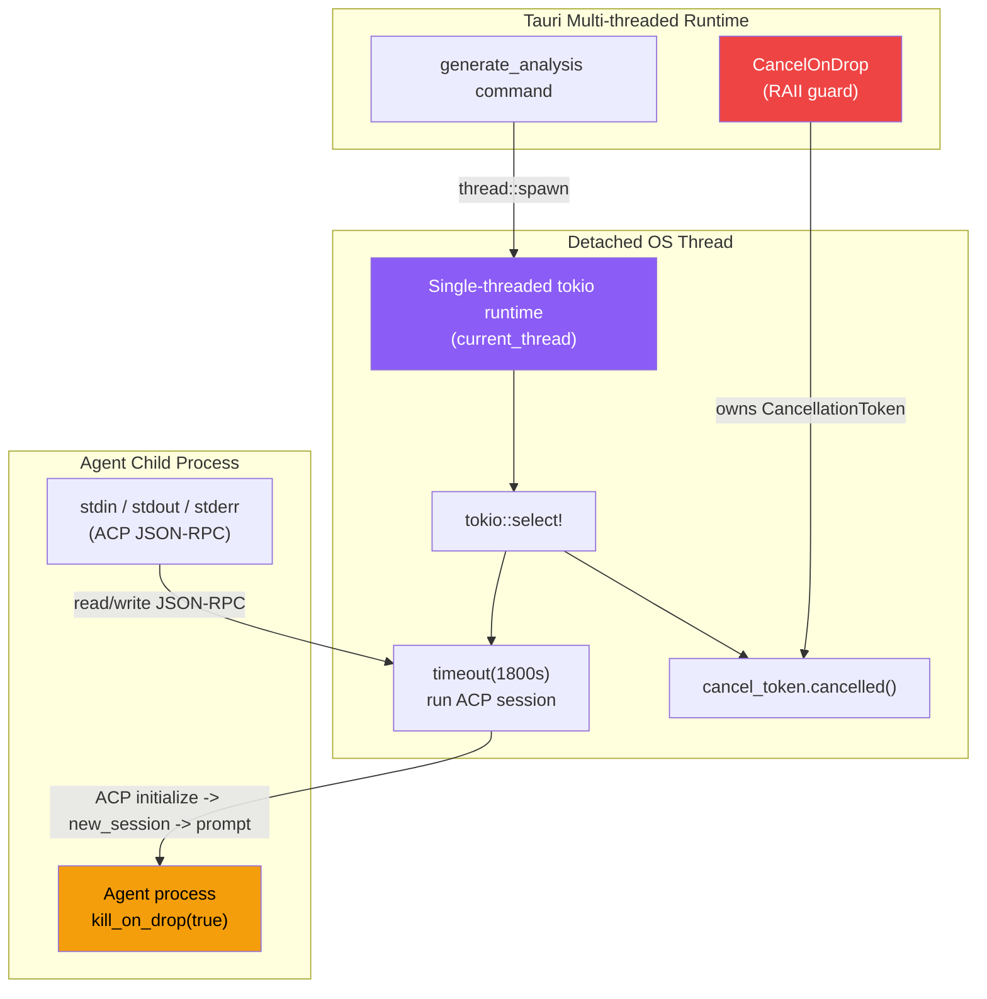
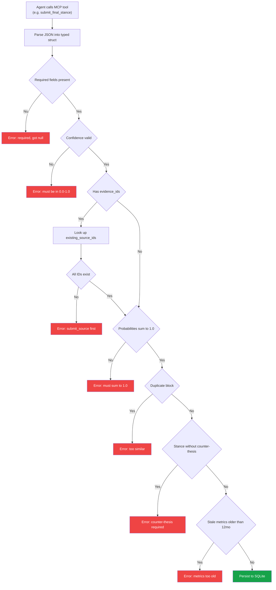
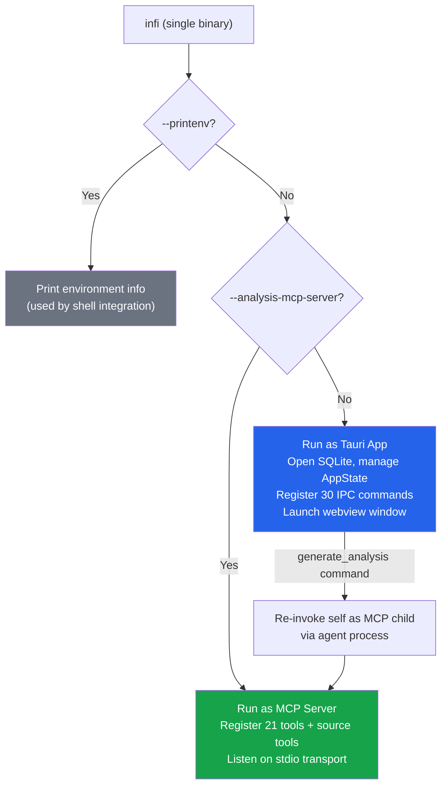
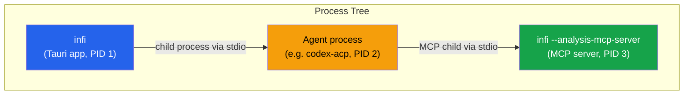
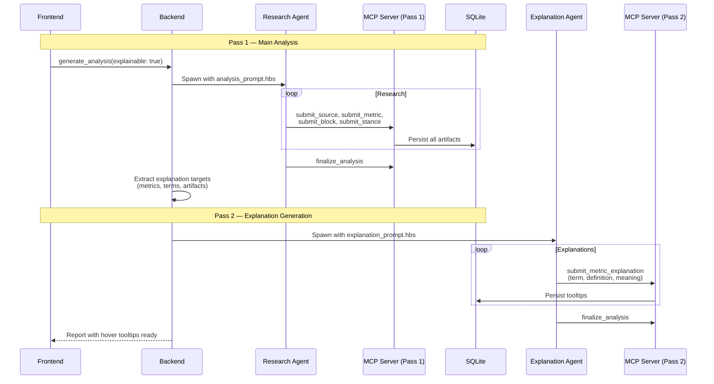
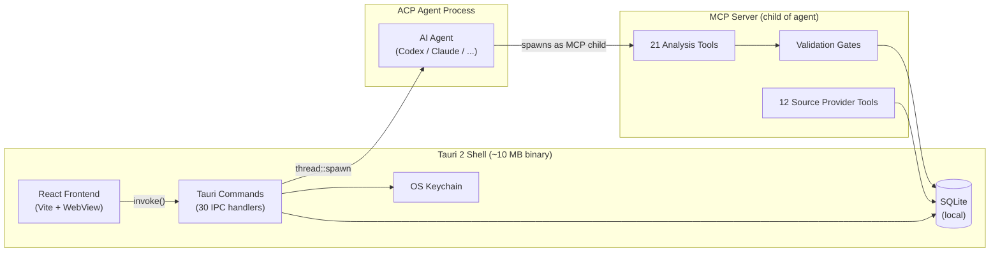

This is the story of building Infi: a local-first AI stock research workbench powered by desktop agents, structured MCP tools, and a Rust/Tauri app shell. I want to explain the problem we were trying to solve, the product decisions behind Infi, the architecture that made it work, and the engineering lessons I learned while turning a vague idea — "make AI financial research trustworthy" — into a usable desktop application.

---

## The Problem: Why Beginners Lose Money in the Stock Market

### Vietnam's Stock Market Boom — And Its Hidden Crisis

Vietnam's stock market is exploding. Over 11.8 million securities accounts as of early 2026, with 2.6 million added in 2025 alone. Nearly 75% of retail investors are under 35. The numbers sound exciting — until you realize that an estimated 95% of retail traders fail to sustain profits over time.

We are part of that generation. We saw the problem firsthand: our friends, classmates, and family members opening brokerage accounts, chasing stock tips from Facebook groups and Telegram channels, and losing money — not because they were careless, but because the tools available to them were fundamentally broken.

### What Makes Investing So Hard for Beginners?

The core issue is not a lack of data. It is a lack of _understanding_. Let me explain with a simple analogy.

Imagine you want to buy a smartphone. You would look at specs, read reviews, compare prices, and maybe watch a YouTube video. The information is organized, digestible, and presented in a way that helps you make a decision.

Now imagine buying a stock. You need to understand:

- **Financial statements** — What is revenue? What is net profit margin? What does a P/E ratio of 15 mean?
- **Technical charts** — What is RSI? What does MACD tell you? When is a stock "overbought"?
- **Market news** — How does a central bank interest rate decision affect your stock?
- **Valuation models** — Is this stock cheap at this price, or is it a value trap?

For a beginner, this is like reading a foreign language. And the tools available make it worse, not better.

### Where Beginners Get Their Information Today

Financial data is everywhere, but it arrives fragmented:

- Price charts live in brokerage apps (SSI, VNDirect, TCBS).
- Financial statements live in PDFs, exchange websites, and data portals.
- News comes from media sites, social feeds, and newsletters.
- Analyst opinions are scattered across reports that beginners cannot easily compare.
- Personal portfolio context stays inside spreadsheets or brokerage dashboards.

For a professional analyst, this fragmentation is annoying but manageable. For a new investor, it is overwhelming. The beginner does not just need another ratio table. They need a system that can answer: "What matters here?", "Which claims are backed by evidence?", "How stale is this data?", and "What would change the conclusion?"

### The Real Cost of Getting It Wrong

The numbers tell a painful story:

| Metric                                     | Value              | Source                         |
| :----------------------------------------- | :----------------- | :----------------------------- |
| Financially literate adults in Vietnam     | 24% (rank 118/144) | S&P Global FinLit Survey       |
| Daily trading value from retail investors  | 90%                | Visa Financial Literacy Survey |
| Retail traders who fail to sustain profits | ~95%               | VinaCapital, 2024              |
| Retail investors under 35 years old        | 75%                | Vietnam Securities Depository  |

This is not just a statistics problem. These are real people — our friends, classmates, and family members — who are losing real money because they lack the tools to make informed decisions.

---

## Background Research: What Exists Today And Why It Falls Short

We spent weeks mapping the landscape of investment research tools. Here is what we found:

### Existing Solutions And Their Limitations

| Solution                                 | What It Does                          | Why It Fails Beginners                                                                                               |
| :--------------------------------------- | :------------------------------------ | :------------------------------------------------------------------------------------------------------------------- |
| **Bloomberg Terminal**                   | Professional-grade analytics and data | Costs $24,000/year. Built for professionals, not beginners.                                                          |
| **ChatGPT / Claude**                     | AI chatbots that can discuss stocks   | Produces plausible-sounding analysis with no source citations. No way to verify if numbers are real or hallucinated. |
| **Yahoo Finance, CafeF, Vietstock**      | Raw financial data portals            | Beginners do not know how to interpret financial statements, RSI charts, or valuation ratios.                        |
| **Brokerage apps (SSI, VNDirect, TCBS)** | Trading execution platforms           | Built for execution, not education. Assume you already know what you are doing.                                      |
| **FinGPT, FinRL (Academic)**             | Open-source AI finance research       | Research prototypes with no production UI. Single-model focus.                                                       |

The gap was clear: **no tool combined multi-agent AI orchestration, structured typed output, source-backed claims, and local-first privacy in a single desktop application.**

> We did not want to replace brokers. We wanted to empower the next generation of investors to use them effectively.

### The Trust Problem With AI Research

The first instinct was obvious: use an LLM to write a stock report. That prototype was fast to build and impressive for about five minutes. Then the cracks showed.

The model could explain gross margin beautifully, but sometimes used an outdated figure. It could produce a confident buy recommendation, but the supporting evidence was vague. It could cite "recent filings" without linking to the actual source. It could mix real numbers with plausible numbers in the same paragraph, and the prose was polished enough that the mistake was hard to notice.

That is the most dangerous failure mode in financial research: not an obviously bad answer, but a confident answer that is hard to audit.

So the real challenge was not "how do we make AI write better?" It was:

- How do we make every claim traceable?
- How do we prevent final recommendations that ignore their own risk evidence?
- How do we separate source collection, metric extraction, reasoning, and explanation?
- How do we make the output useful to a beginner without hiding the evidence?
- How do we keep portfolio data local?

This shifted the project away from "AI chat for stocks" and toward a structured research operating system.

---

## The Idea: What Infi Is And How It Works For Users

### The Elevator Pitch

**Infi** is an AI-powered desktop app that helps you research stocks and portfolios. You type a question — "Analyze VNM (Vinamilk) for a 12-month horizon" — and an AI agent fetches data from 12 providers, structures every claim as a source-backed block, and assembles a comprehensive report.

The key innovation: **every claim in the report is traceable to its original source.** No hallucinated numbers. No vague citations. No unverifiable claims.

### What Infi Does For A Beginner

From the user's perspective, Infi has three main workflows:

**1. Single-Stock Research** — You enter a prompt like:

```
Analyze FPT for a 12-month horizon. Focus on growth quality, valuation risk, and downside scenarios.
```

Infi creates an analysis run, launches the selected AI agent, attaches the data-source MCP tools, and streams progress back into the app. The final report is not just a text answer. It is a structured artifact with:

- A research plan.
- Resolved entities and tickers.
- Source list with publishers, URLs, retrieval dates, and reliability labels.
- Metric snapshots with periods, units, prior values, and source IDs.
- Analysis blocks for thesis, valuation, risks, catalysts, uncertainty, and counter-thesis.
- Scenario projections with probability-weighted assumptions.
- A final stance with confidence, horizon, key reasons, and "what would change my mind."



**2. Portfolio Analysis** — Instead of analyzing one ticker, you import holdings from CSV and ask questions like:

```
Review this portfolio for concentration risk and suggest a defensive rebalancing plan.
```

Infi parses the holdings, stores the portfolio locally, and asks the agent to review allocation, risk exposures, expected returns, stress cases, and rebalancing suggestions. This mattered because many beginners do not lose money only from picking one bad stock; they lose because their entire portfolio is accidentally concentrated in one theme, sector, or macro bet.





**3. Report Sharing** — A completed report can be exported to standalone HTML. That file contains the report viewer and the serialized report data, so it can be opened without the Infi app or a backend server.

### Why A Desktop App?

I chose a desktop app deliberately. A cloud web app would have been easier to deploy, but it would have forced uncomfortable trade-offs:

- Portfolio data would need to leave the user's machine.
- API keys would need to be stored or proxied somewhere.
- Agent execution would require server-side process orchestration.
- Local tools like Codex, Claude Code, OpenCode, or custom ACP agents would be harder to integrate.

Tauri gave Infi the right shape: a Rust backend with native access to SQLite, OS keychain, child processes, and filesystem exports, plus a React frontend for fast UI iteration. The app can run fully local while still feeling like a modern web application.

---

## Technology Deep Dive

Now let's go deeper into the core technologies that power Infi. If you are not familiar with these, don't worry — I will explain each one from scratch.

### Tauri 2: The Desktop App Framework

#### What Is Tauri?

[Tauri](https://v2.tauri.app/) is a framework for building desktop applications. Think of it as an alternative to Electron (which powers apps like VS Code and Slack), but much lighter.

Here is the key difference:

| Feature          | Electron                       | Tauri 2                                                               |
| :--------------- | :----------------------------- | :-------------------------------------------------------------------- |
| How it renders   | Bundles its own Chrome browser | Uses the OS's built-in webview (WebKit on macOS, WebView2 on Windows) |
| Bundle size      | ~150 MB+                       | ~10 MB                                                                |
| RAM usage        | ~200 MB+                       | ~5 MB                                                                 |
| Startup time     | 2-5 seconds                    | < 1 second                                                            |
| Backend language | Node.js                        | Rust                                                                  |

Tauri lets you build a desktop app with a web frontend (React, Vue, Svelte, etc.) and a native backend (Rust). The frontend runs inside a webview, and the backend handles system-level operations like file access, database, and process management.

#### Why Tauri For Infi?

We needed three things that a web app cannot provide:

1. **Local SQLite database** — Infi stores all analyses, reports, and portfolio data locally. No cloud, no server.
2. **OS keychain access** — API keys for data providers (Tavily, Alpha Vantage, etc.) are stored securely in the operating system's credential store, never in plaintext files.
3. **Child process management** — Infi spawns AI agents (Codex, Claude, Gemini, etc.) as child processes. This requires native OS access.

Tauri 2 gives us all of this while still letting us build the UI with React and TypeScript.

#### How Tauri Works In Infi

```
┌─────────────────────────────────────────────────────────────┐
│                    Tauri 2 Architecture                       │
├─────────────────────────────────────────────────────────────┤
│                                                              │
│  ┌──────────────────────────────────────────────────────┐   │
│  │              Frontend (Vite + React + TypeScript)      │   │
│  │  ┌────────────┐  ┌────────────┐  ┌──────────────┐    │   │
│  │  │  Research   │  │  Analysis  │  │  Portfolio   │    │   │
│  │  │  Composer   │  │  Viewer    │  │  Manager     │    │   │
│  │  └──────┬─────┘  └──────┬─────┘  └──────┬───────┘    │   │
│  │         │               │               │             │   │
│  │         └───────────────┼───────────────┘             │   │
│  │                         │                             │   │
│  │                    invoke() / Channel                  │   │
│  │                         │                             │   │
│  └─────────────────────────┼─────────────────────────────┘   │
│                            │                                 │
│  ┌─────────────────────────┼─────────────────────────────┐   │
│  │              Rust Backend (Tauri Commands)              │   │
│  │  ┌──────────────┐  ┌──────────────┐  ┌────────────┐  │   │
│  │  │  30 IPC       │  │  SQLite      │  │  OS        │  │   │
│  │  │  Commands     │  │  Database    │  │  Keychain  │  │   │
│  │  └──────────────┘  └──────────────┘  └────────────┘  │   │
│  └───────────────────────────────────────────────────────┘   │
│                                                              │
│  Compiled to: ~10 MB single binary                           │
│  RAM usage: ~5 MB                                            │
│  Startup: < 1 second                                         │
└─────────────────────────────────────────────────────────────┘
```

The frontend (React) talks to the backend (Rust) through Tauri's `invoke()` mechanism. When you click "Start Analysis" in the UI, the frontend calls `invoke("generate_analysis", { ... })`, which crosses the IPC bridge, deserializes on the Rust side, and executes the command.

For long-running operations like agent execution, Infi uses Tauri's `Channel` type to stream real-time progress events from Rust to the frontend.

---

### React: The Frontend

#### What Is React?

[React](https://react.dev/) is a JavaScript library for building user interfaces. It lets you break your UI into reusable components — small, self-contained pieces that manage their own state and render their own output.

#### Why React For Infi?

We chose React because:

1. **Fast iteration** — Hot module replacement (HMR) via Vite means changes appear instantly during development.
2. **Type safety** — TypeScript catches bugs at compile time, not runtime.
3. **Ecosystem** — React Query for server state, Tailwind CSS for styling, and a massive library ecosystem.
4. **Tauri compatibility** — Tauri's frontend is just a webview. Any web framework works, but React's component model made our editorial design system easy to build.

#### Frontend Architecture

```
frontend/src/
├── features/               # Feature modules
│   ├── run-analysis/       # Research composer, live progress
│   ├── analysis/           # Analysis page with report/agent tabs
│   ├── report-viewer/      # Report hero, blocks, metrics, projections
│   ├── portfolio/          # Portfolio management, CSV import
│   ├── settings/           # Agent selection, API key management
│   └── updates/            # Self-update dialog
├── shared/
│   ├── api/                # Typed wrappers around Tauri invoke
│   └── components/         # Reusable UI primitives
└── store/                  # Global state (useSyncExternalStore)
```

The UI design is editorial — inspired by Bloomberg Terminal, Financial Times, and The Economist. Hairline dividers, restrained color, dense but readable sections. The report viewer is calm and focused. The live agent output is closer to a terminal/log surface, because the user needs to see what the agent is doing.



---

### Agent Client Protocol (ACP): Talking To Any AI Agent

#### What Is ACP?

The [Agent Client Protocol (ACP)](https://zed.dev/blog/agent-client-protocol) is a standardized protocol for communicating with AI agents. Think of it like USB for AI agents — a universal plug that lets any client application talk to any compatible agent.

Before ACP, if you wanted to integrate Claude, GPT, Gemini, and Qwen into your app, you would need to write custom integration code for each one. Each has its own API, its own authentication, its own streaming format, and its own error handling.

ACP solves this by defining a standard interface:

```
┌──────────────┐         ACP (stdio)         ┌──────────────┐
│              │  ──────────────────────────▶ │              │
│  Infi App    │  initialize()               │  AI Agent    │
│  (Client)    │  new_session()              │  (Server)    │
│              │  prompt()                   │              │
│              │  ◀────────────────────────── │              │
│              │  progress events             │              │
└──────────────┘  completion signal           └──────────────┘
```

The communication happens over **stdio** (standard input/output) — the same way command-line programs read input and write output. This is simple, reliable, and works on any operating system.

#### Why ACP For Infi?

We wanted Infi to work with multiple AI agents, not just one. Today, Infi supports 7 built-in agents:

| Agent        | Binary     | How It's Launched                  |
| :----------- | :--------- | :--------------------------------- |
| **Codex**    | `npx`      | `@zed-industries/codex-acp@latest` |
| **Claude**   | `npx`      | `@zed-industries/claude-code-acp`  |
| **Gemini**   | `gemini`   | native binary                      |
| **Qwen**     | `qwen`     | native binary                      |
| **Kimi**     | `kimi`     | native binary                      |
| **Mistral**  | `vibe-acp` | native binary                      |
| **OpenCode** | `opencode` | native binary                      |

Plus a "custom" option where you can configure any ACP-compatible agent.

ACP means we do not need to maintain separate integrations for each agent. The protocol handles initialization, session management, prompt delivery, and progress streaming.

#### The Threading Problem (And How We Solved It)

ACP connections are `!Send` — they cannot be moved across async tasks. But Tauri's async runtime expects commands to be `Send`. We spent days debugging panics and deadlocks before arriving at the solution: spawn a dedicated OS thread with its own single-threaded tokio runtime for each ACP session.



The key insight was that `CancelOnDrop` is an RAII struct that calls `token.cancel()` in its `Drop` impl. When the Tauri command future is dropped — whether because the user navigated away, the app panicked, or the command completed — the guard fires automatically. This ensures the agent process never becomes an orphan.

```rust
// Simplified version of the pattern
let handle = std::thread::spawn(move || {
    let rt = tokio::runtime::Builder::new_current_thread()
        .enable_all()
        .build()
        .unwrap();
    rt.block_on(async {
        let _guard = CancelOnDrop(token.clone());
        tokio::select! {
            result = tokio::time::timeout(
                Duration::from_secs(1800),
                run_acp_session(agent, mcp_server),
            ) => result,
            () = token.cancelled() => Err(AcpCancelled),
        }
    });
});
```

---

### Model Context Protocol (MCP): Controlling Agent Output

#### What Is MCP?

The [Model Context Protocol (MCP)](https://modelcontextprotocol.io/) is a protocol that lets AI agents call external tools. Think of it as a way to give an AI agent superpowers — the ability to search the web, read databases, call APIs, or in Infi's case, submit structured research data.

Here is how it works in simple terms:

```
┌──────────────┐         MCP (stdio)         ┌──────────────┐
│              │  ──────────────────────────▶ │              │
│  AI Agent    │  "I want to submit a         │  MCP Server  │
│              │   metric snapshot"           │  (Infi)      │
│              │                              │              │
│              │  ◀────────────────────────── │              │
│              │  "OK, persisted to SQLite"   │              │
│              │  or "Error: missing source"  │              │
└──────────────┘                              └──────────────┘
```

The agent calls a tool (like `submit_metric_snapshot`), the MCP server validates the input, persists it to the database, and returns success or an error.

#### Why MCP Is The Core Innovation

This is where Infi's architecture gets interesting. Most AI apps use MCP as a way to **read** data — "search the web", "fetch stock price", "read a file". Infi uses MCP as a way to **write** structured data — and to **enforce constraints** on what the agent can output.

Here is the critical difference:

| Approach                | Agent Output                    | Trustworthiness                               |
| :---------------------- | :------------------------------ | :-------------------------------------------- |
| **Traditional AI chat** | Free-form text                  | No verification possible                      |
| **Infi with MCP**       | Structured data via typed tools | Every claim is validated before it's accepted |

The agent cannot hallucinate a final stance without:

1. Citing at least one submitted source
2. Having no blocking uncertainties unresolved
3. Maintaining probability consistency across scenarios
4. Passing stance coherence checks (e.g., bullish stance rejected if all risk blocks have low confidence)

#### The 21 MCP Tools

Infi exposes 21 structured tools that the agent must use to submit output:

**Research Tools (15):**

| Tool                               | Purpose                                   | Validation Rules                                |
| :--------------------------------- | :---------------------------------------- | :---------------------------------------------- |
| `submit_research_plan`             | Submit interpreted research plan          | Must be non-empty                               |
| `submit_entity_resolution`         | Resolve ticker/company/ETF/index/sector   | Must match known entities                       |
| `submit_source`                    | Cite a data source before referencing     | URL must be valid                               |
| `verify_source_accessibility`      | HEAD/GET probe of source URL              | Must return 2xx                                 |
| `submit_metric_snapshot`           | Submit normalized numeric metric          | `evidence_ids` must reference submitted sources |
| `submit_metric_explanation`        | Plain-language metric explanation         | Must target valid metric                        |
| `submit_structured_artifact`       | Typed table/chart (11 kinds)              | Must match schema                               |
| `submit_analysis_block`            | Prose section (10 kinds)                  | Must cite evidence                              |
| `submit_final_stance`              | Investment stance with confidence         | Must have counter-thesis, evidence IDs          |
| `submit_projection`                | Forward-looking projection with scenarios | Probabilities must sum to 1.0                   |
| `submit_counter_thesis`            | Case against chosen direction             | Required before final stance                    |
| `submit_uncertainty_ledger`        | Open question with blocking flag          | Blocks high-confidence stances                  |
| `submit_methodology_note`          | Research approach documentation           | —                                               |
| `submit_decision_criterion_answer` | Per-criterion verdicts                    | —                                               |
| `finalize_analysis`                | Completion signal                         | Checks all prerequisites                        |

**Portfolio Tools (6):**

| Tool                                     | Purpose                           |
| :--------------------------------------- | :-------------------------------- |
| `submit_holding_review`                  | Per-holding stance                |
| `submit_allocation_review`               | Allocation breakdown              |
| `submit_portfolio_risk`                  | Factor exposures, macro risks     |
| `submit_rebalancing_suggestion`          | Current vs. suggested weights     |
| `submit_portfolio_scenario_analysis`     | Bull/base/bear portfolio outcomes |
| `submit_portfolio_expected_return_model` | Return/volatility model           |

#### Validation Gates: The Trust Engine

Every time the agent calls an MCP tool, the server runs a validation pipeline:



Every validation failure returns a descriptive error to the agent. The agent sees something like `"evidence_ids: unknown ['src_xyz']; submit_source them first"` and has to correct its approach. This is the mechanism that transforms the agent from a "writer" into a "research worker" — the tool contract forces discipline that no prompt could guarantee.

---

### The Single Binary, Three Roles

One of the things that surprised me about Rust + Tauri is that the same compiled binary serves three completely different roles depending on CLI flags:



When the user starts an analysis, the Tauri app spawns an AI agent as a child process. That agent, in turn, spawns the same Infi binary with `--analysis-mcp-server` as its own MCP child. The binary is the MCP server — it does not need a separate installation.



---

### The Two-Pass System

One of the features we are most proud of is the two-pass analysis system:

- **Pass 1 (Main Analysis):** The agent researches the stock or portfolio — fetching data, submitting sources, metrics, analysis blocks, and a final stance. This pass focuses on depth and accuracy.

- **Pass 2 (Explain Tooltips):** A second agent scans the completed report for financial terms and metrics, then generates plain-language explanations. These render as hover tooltips in the UI. A term like "EV/EBITDA" gets a concise definition that a beginner can understand.

Different models can be used for each pass, allowing optimal separation of concerns.





---

## Demo: Infi In Action

### Starting A New Analysis

When you open Infi, you see the research composer. You type your question, select an agent (Codex, Claude, Gemini, etc.), and click "Start Analysis".



### The Report: Sources

Every source cited in the report is listed with its publisher, URL, retrieval date, and reliability label. You can click any source to verify it yourself.



### The Report: Thesis And Analysis

The report is structured into typed blocks — Thesis, Financials, Valuation, Risks, Catalysts. Each block cites its evidence and has a confidence level.



### The Report: Scenarios And Projections

Price projections are presented as bull/base/bear scenarios with probability weights. The probabilities must sum to 1.0 — enforced by the MCP validation gate.



### The Report: Scenario Matrix

The scenario matrix shows how different assumptions affect the outcome. Each scenario is backed by specific data points and reasoning.



### The Report: Final Stance

The final stance is the investment conclusion — Bullish, Neutral, Bearish, or Mixed — with a confidence level, key reasons, and "what would change my mind". This is only accepted if all validation gates pass.



### Portfolio Analysis

For portfolio analysis, Infi reviews your holdings for concentration risk, factor exposures, and suggests rebalancing strategies.





---

## Architecture Summary



### The Numbers

| Metric               | Value                             |
| :------------------- | :-------------------------------- |
| MCP tools            | 21 (15 research + 6 portfolio)    |
| Data providers       | 12 (5 free, 7 requiring API keys) |
| Supported agents     | 7 built-in + custom               |
| Binary size          | ~10 MB                            |
| RAM usage            | ~5 MB                             |
| Startup time         | < 1 second                        |
| Source citation rate | 100% (enforced by MCP)            |
| SQLite tables        | 25+                               |

---

## What We Learned

### Lesson 1: MCP Is Not Just a Protocol — It Is a Control Plane

Before Infi, we thought of MCP as a way for AI to call external tools. We learned that MCP is actually a **control plane for agent output**. By defining 21 typed tools and enforcing validation at the server level, we turned the agent into a structured data producer rather than a free-form text generator.

### Lesson 2: The Agent Is a Worker, Not a Writer

This was the hardest lesson. Early prototypes gave the agent too much freedom. The output was fluent but unreliable. Once we enforced the "agent as worker" pattern — where the agent's job is to fetch data and submit it through structured tools, not to write the final report — everything clicked.

### Lesson 3: Validation Gates Are More Important Than Prompt Engineering

We spent weeks iterating on prompts before realizing that prompt engineering alone cannot guarantee output quality. The validation gates in the MCP server — evidence chain checks, probability sum validation, stance coherence rules — do more for report quality than any prompt template.

### Lesson 4: Local-First Is a Feature, Not a Limitation

Users told us they _preferred_ knowing their portfolio data and research queries never left their machine. The OS keychain integration means API keys are never stored in plaintext. SQLite with WAL mode gives us transactional safety without a database server.

### Lesson 5: Product Constraints Should Become Software Constraints

If a product value matters, encode it into the architecture. Otherwise it becomes a slogan.

- Trustworthy means validation gates and evidence IDs.
- Beginner-friendly means explanation tooltips and readable report sections.
- Local-first means SQLite, OS keychain, and local child processes.
- Source-backed means rejecting records that cite nonexistent sources.
- Multiple agents means using ACP instead of building around one vendor SDK.

---

## Try It Yourself

Infi is open source under MIT/Apache-2.0. You can install it via Homebrew or download from GitHub Releases:

```bash
# macOS
brew install --cask khanhthanhdev/tap/infi

# Or build from source
git clone https://github.com/khanhthanhdev/infi.git
cd infi && cargo run
```

You will need at least one AI agent installed (we recommend starting with Claude Code or Codex) and at least one data source API key (Tavily and Alpha Vantage have free tiers).

Every report includes a disclaimer: _Research tool. Does not execute trades or provide investment advice._ We mean it. Infi is a research workbench, not a trading platform. Use it to understand, not to gamble.

---

<p align="center">
  <em>Research tool. Does not execute trades or provide investment advice.</em>
</p>
