StemFun started from a simple teaching problem: STEM subjects often become difficult not because the formulas are unavailable, but because learners cannot see why those formulas emerge. Many online learning platforms provide exercises, worked answers, and recorded explanation videos, yet the path from a real-world situation to a model, equation, diagram, or algorithm is still hard to follow. This gap is especially visible in math, physics, chemistry, and programming topics where learners need motion, structure, and step-by-step visual reasoning rather than static text.

The research direction behind StemFun was to combine generative AI with deterministic scientific animation. General AI video tools can quickly create marketing-style clips or avatar-led lessons, but they struggle with precise graphs, geometric relationships, symbolic transformations, simulations, and code execution traces. Instead of relying on diffusion-style video generation, StemFun uses large language models to plan an explanation and generate Manim code, then renders the output through a controllable Python animation pipeline. This keeps the creative flexibility of AI while preserving the precision needed for educational content.

The core idea is to let a learner or teacher describe a STEM concept in natural language, then have the system produce an animated explanation that shows the reasoning process. For example, a physics problem can be decomposed into forces, variables, equations, and visual transitions; a calculus idea can be shown as a changing curve; and a programming tutorial can visualize control flow and data changes over time. The system is designed not only to produce a final video, but also to support inspection, repair, and iterative editing of the generated code.

Technically, StemFun is a full-stack AI rendering platform. It uses a React frontend, an Express/TypeScript backend, a Redis-backed Bull queue for asynchronous jobs, AI generation and repair services, and a Python/Manim runtime for video or image rendering. The project has two main product modes:

1. **Workflow Mode**: one-shot generation through an async job pipeline.
2. **Agent Mode**: long-lived Studio sessions where an AI agent can read files, write code, request permissions, run checks, render outputs, and spawn reviewer or designer subagents.

---

## System Overview

<video src="/assets/video/stemfun.mp4" controls width="100%"></video>

StemFun is a full-stack application with a React frontend, Express/TypeScript backend, Redis-backed Bull queue, Python/Manim render runtime, and optional Supabase persistence.

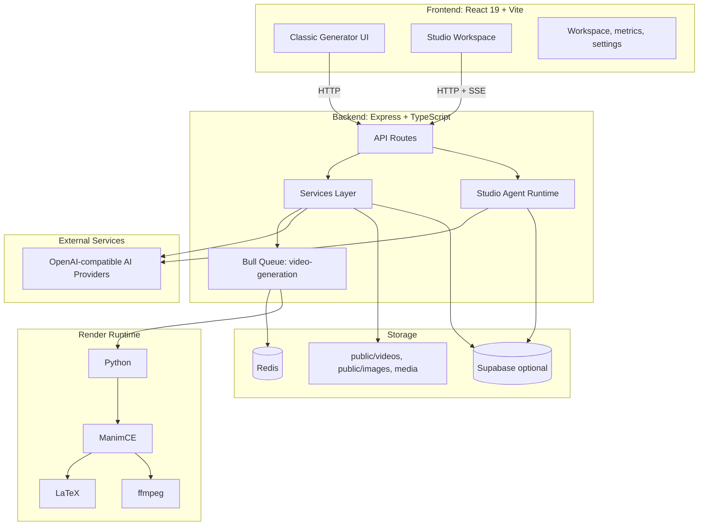

Main backend entry points:

| Area           | Files                                                                | Purpose                                                                      |
| -------------- | -------------------------------------------------------------------- | ---------------------------------------------------------------------------- |
| Server boot    | `src/server.ts`, `src/server/bootstrap.ts`                           | Express app, middleware, static files, route registration                    |
| Routes         | `src/routes/*.route.ts`                                              | Generation, modification, status, cancellation, Studio API, history, metrics |
| Queue          | `src/config/bull.ts`, `src/queues/processors/video.processor.ts`     | Async generation and render jobs                                             |
| AI generation  | `src/services/concept-designer.ts`, `src/services/concept-designer/` | Scene design and Manim code generation                                       |
| Static guard   | `src/services/static-guard/`                                         | Python syntax/type checks and AI patch loop                                  |
| Render retry   | `src/services/code-retry/`                                           | AI-assisted repair after Manim render failure                                |
| Studio runtime | `src/studio-agent/`                                                  | Agent sessions, tools, permissions, runs, tasks, work results                |

---

## Product Modes

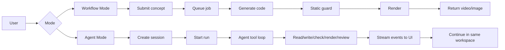

| Dimension        | Workflow Mode                    | Agent Mode                                            |
| ---------------- | -------------------------------- | ----------------------------------------------------- |
| Interaction      | Single request, async job result | Multi-turn session                                    |
| State            | Job-based, temporary             | Session-based, workspace-backed                       |
| Frontend updates | Polling                          | Server-Sent Events                                    |
| AI behavior      | Pipeline stages                  | Tool-using agent loop                                 |
| Review           | Static guard and render retry    | Static check, AI review, reviewer subagent            |
| Workspace        | Generated temp code/media        | Persistent session directory                          |
| Best for         | Direct video/image generation    | Iterative creation, code editing, review, longer work |

---

## Workflow Mode

Workflow Mode starts from `POST /api/generate`. The route validates the request, stores initial job state, enqueues a Bull job, and returns a `jobId`. The frontend then polls job status until completion.

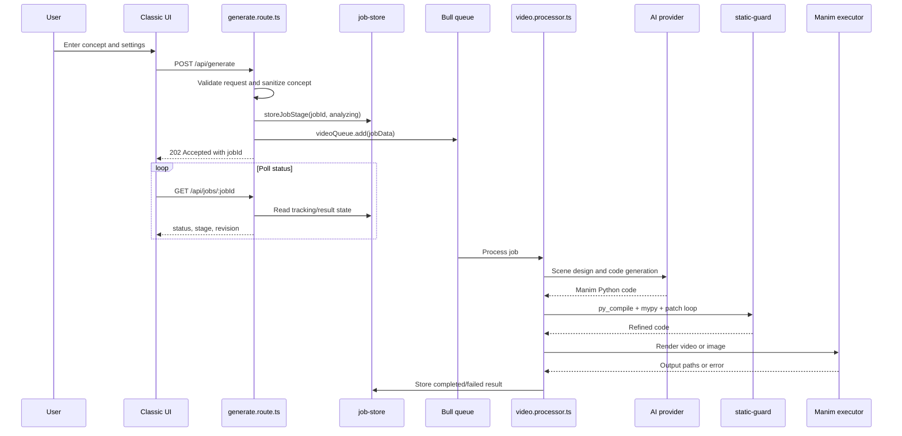

### Request Shape

```typescript
{
  concept: string
  problemPlan?: ProblemFramingPlan
  outputMode: 'video' | 'image'
  quality: 'low' | 'medium' | 'high'
  code?: string
  customApiConfig?: { apiUrl: string; apiKey: string; model: string }
  promptOverrides?: PromptOverrides
  videoConfig?: VideoConfig
  referenceImages?: ReferenceImage[]
  renderCacheKey?: string
}
```

### Processor Flow Types

The queue processor dispatches into three flows:

| Flow               | Trigger                              | Behavior                                          |
| ------------------ | ------------------------------------ | ------------------------------------------------- |
| Generation flow    | Default                              | Design scene, generate code, static guard, render |
| Pre-generated flow | `code` provided                      | Skip AI generation, check/render supplied code    |
| Edit flow          | Existing code plus edit instructions | AI edits code, static guard, render               |

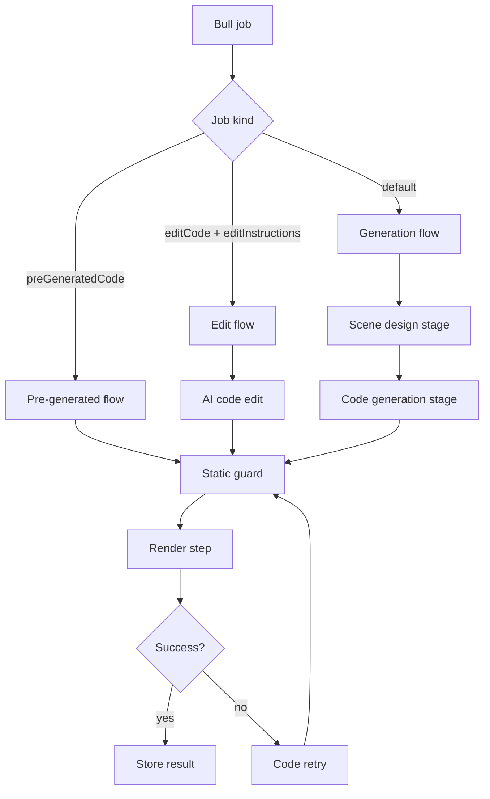

---

## Problem Framing

Problem framing is an optional pre-generation step exposed by `POST /api/problem-frame`. It turns a raw concept into a structured teaching plan that can be reviewed by the user before generation.

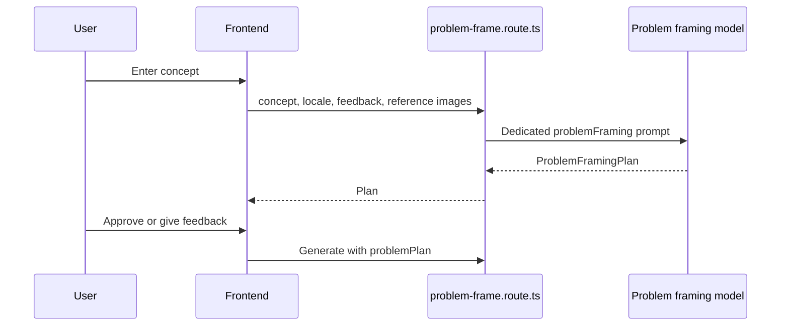

`ProblemFramingPlan` fields:

| Field          | Meaning                                                                   |
| -------------- | ------------------------------------------------------------------------- |
| `mode`         | `clarify` for a specific prompt, `invent` when the prompt needs structure |
| `headline`     | Short title for the generation plan                                       |
| `summary`      | Brief teaching objective                                                  |
| `steps`        | Up to six planned explanation steps                                       |
| `visualMotif`  | Repeated visual metaphor or style                                         |
| `designerHint` | Downstream guidance for the scene design stage                            |

When passed to generation, the plan is merged into the concept text as problem framing context.

---

## Two-Stage AI Generation

StemFun separates creative planning from precise code generation.

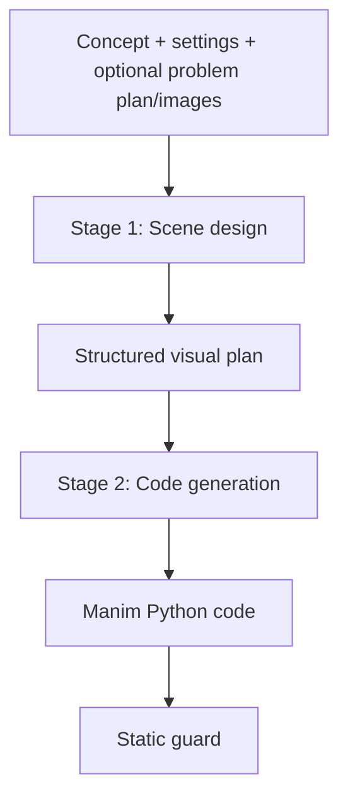

### Stage 1: Scene Design

Implemented in `src/services/concept-designer/scene-design-stage.ts`.

- Uses the `conceptDesigner` system prompt.
- Receives concept, output mode, seed, and optional reference images.
- Produces a scene design plan describing objects, motion, pacing, visual structure, and teaching story.
- Supports vision input by attaching uploaded reference images as `image_url` message parts.
- Falls back to text-only input if a provider rejects images.
- Defaults: `DESIGNER_TEMPERATURE=0.8`, `DESIGNER_MAX_TOKENS=12000`, `DESIGNER_THINKING_TOKENS=20000`.

### Stage 2: Code Generation

Implemented in `src/services/concept-designer/code-from-design-stage.ts`.

- Uses the `codeGeneration` system prompt.
- Receives the concept, seed, scene design, and output mode.
- Produces Manim Python code.
- Video mode extracts code from `### START ###` / `### END ###` anchors or markdown code fences.
- Image mode strips thinking tags and preserves raw output.
- Defaults: `AI_TEMPERATURE=0.7`, `AI_MAX_TOKENS=12000`.

---

## Static Guard

The static guard validates generated or edited code before rendering. It reduces wasted render attempts and gives the AI a constrained patch loop.

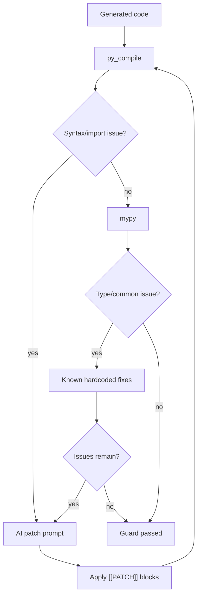

The guard runs:

1. Python compile validation.
2. `mypy` validation with line/column diagnostics.
3. Known hardcoded repairs, such as Manim list-to-tuple parameter fixes.
4. AI patch repair using `[[PATCH]]`, `[[SEARCH]]`, `[[REPLACE]]`, `[[END]]` blocks.
5. Re-validation up to `STATIC_GUARD_MAX_PASSES`, default `3`.

For image mode with multiple `YON_IMAGE` blocks, each scene block is checked separately and diagnostics are mapped back to original line offsets.

---

## Render Pipeline

The render step converts validated Manim code into final media. It supports video and image output paths.

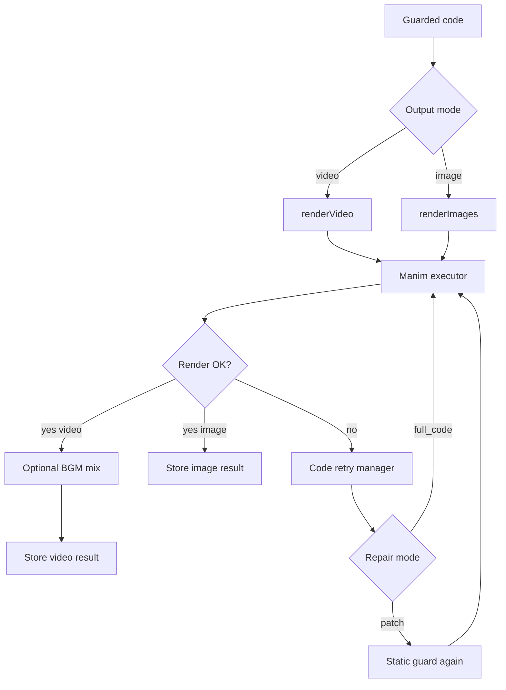

The Manim executor:

- Spawns a Manim subprocess through `src/utils/manim-executor.ts`.
- Supports low, medium, and high resolution settings.
- Applies request-level and default timeout settings.
- Registers active processes so cancellation can terminate them.
- Monitors peak memory and logs render progress.

Video output may be mixed with background music using `src/audio/bgm-mixer.ts`. If mixing fails, the original video remains valid.

---

## Render Repair and Retry

Static validation cannot catch every Manim runtime problem. The code retry manager repairs render failures using error context from Manim stderr.

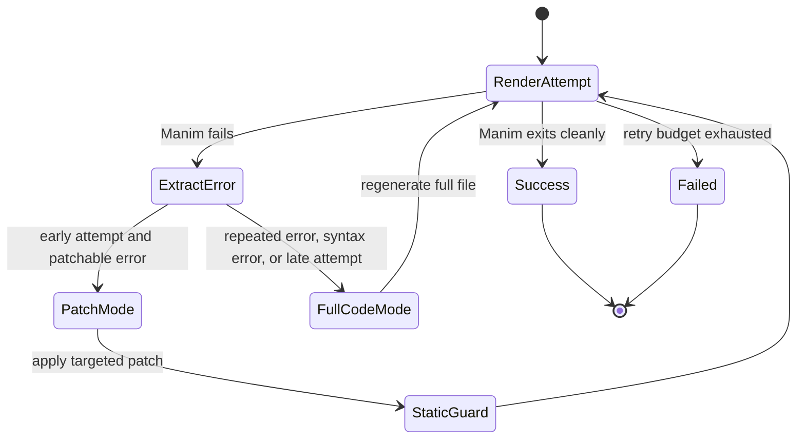

Retry behavior:

| Mechanism           | Detail                                                                                                         |
| ------------------- | -------------------------------------------------------------------------------------------------------------- |
| Max retries         | `CODE_RETRY_MAX_RETRIES`, default `4`                                                                          |
| Patch mode          | AI returns targeted patch blocks around the failing code                                                       |
| Full-code mode      | AI regenerates the whole file                                                                                  |
| Escalation triggers | Attempt >= 3, `SyntaxError`, `IndentationError`, failed patch application, repeated normalized error signature |
| Temperature         | `CODE_RETRY_TEMPERATURE`, default `0.1`                                                                        |

The retry manager normalizes error signatures by removing unstable line numbers, paths, and string literals. This prevents repeating the same failed repair.

---

## Job Management

All Workflow Mode render work is asynchronous. Redis stores queue state, job stages, access metadata, cancellation flags, and final results.

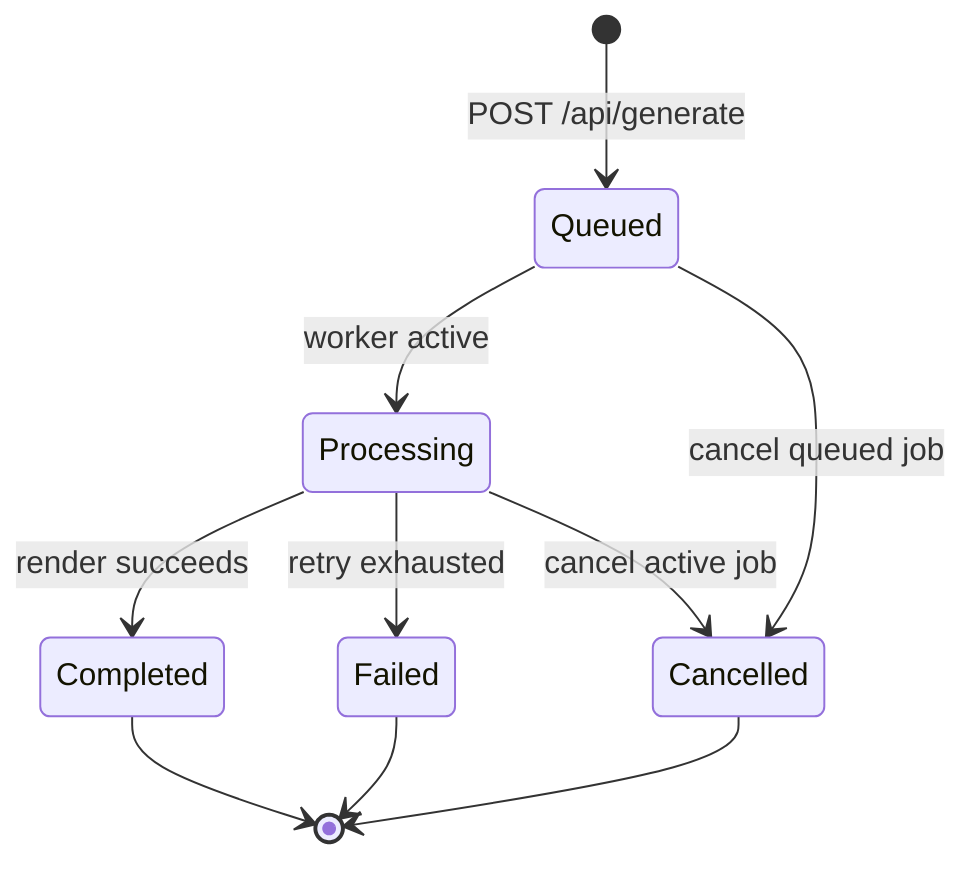

Redis key patterns:

| Key                           | Purpose                               |
| ----------------------------- | ------------------------------------- |
| `job:result:<jobId>`          | Final completed/failed result         |
| `job:result:stage:<jobId>`    | Current processing stage              |
| `job:result:tracking:<jobId>` | Revision, status, attempt, timestamps |
| `job:cancel:<jobId>`          | Cancellation flag and reason          |
| `concept:cache:<hash>`        | Cached generation data                |

Processing stages:

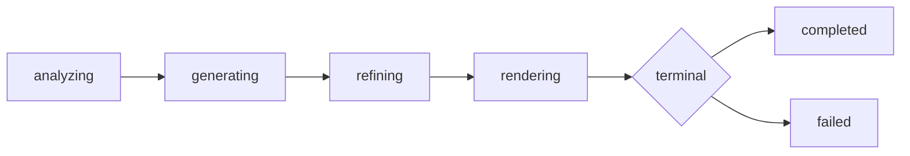

Important behavior:

- `GET /api/jobs/:jobId` checks Bull state first, then Redis result state.
- Job access is bound to API key hash and browser client ID.
- `POST /api/jobs/:jobId/cancel` marks cancellation, removes queued jobs, or kills active Manim processes.
- Job result retention defaults to 24 hours.
- Media cleanup removes old generated files from `public/images/` and `public/videos/`.

---

## Agent Mode

Agent Mode is powered by the Studio Agent runtime in `src/studio-agent/`. It is designed for iterative work where an AI agent can operate inside a session workspace.

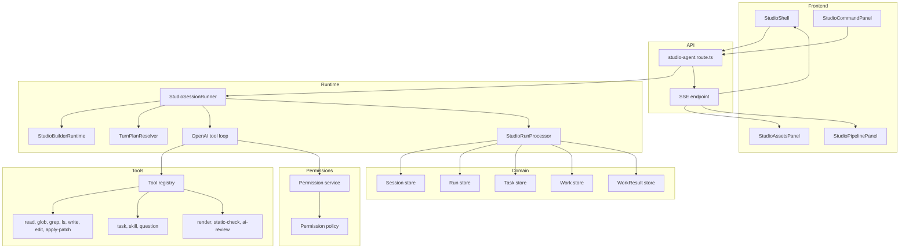

### Session Hierarchy

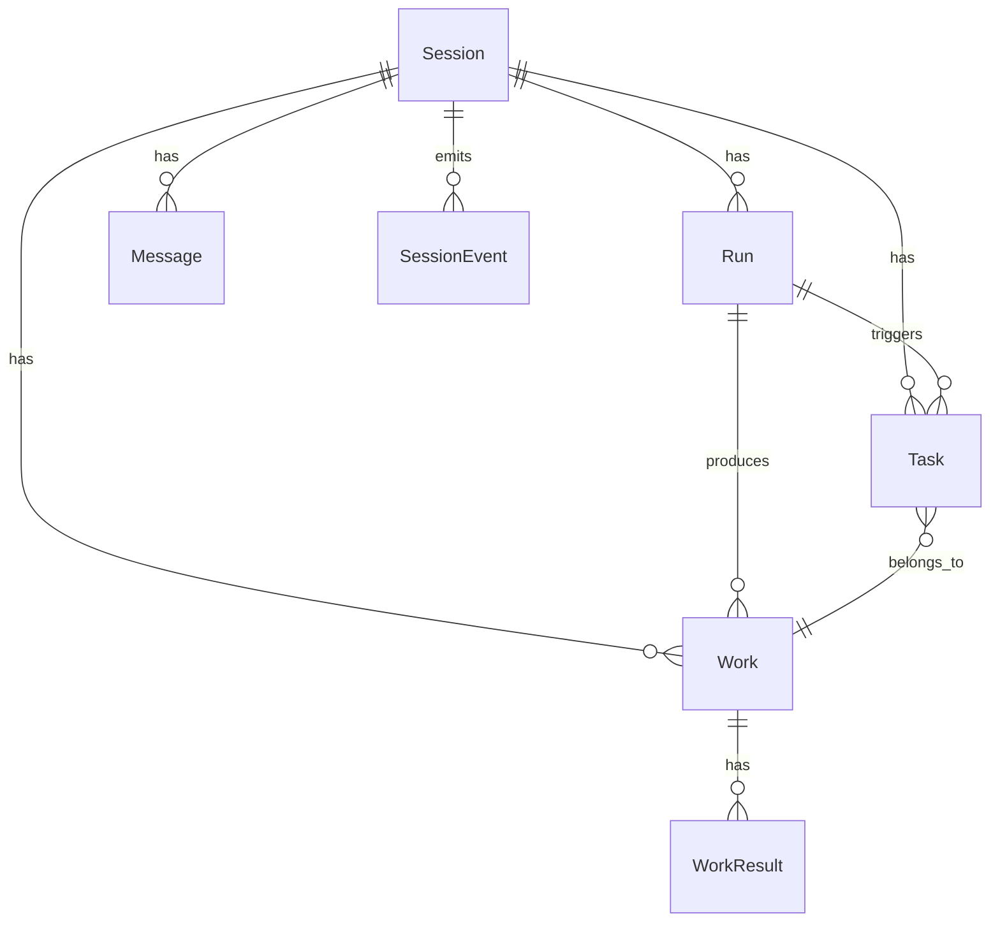

| Entity     | Meaning                                                                                                  |
| ---------- | -------------------------------------------------------------------------------------------------------- |
| Session    | Long-lived workspace context with studio kind, agent type, permissions, messages, runs, tasks, and works |
| Run        | One user interaction cycle; only one active run is allowed per session                                   |
| Message    | User, assistant, system, or tool message part                                                            |
| Task       | A concrete step such as tool execution, render, static check, review, or subagent run                    |
| Work       | A user-visible work item such as video, plot, design, review, edit, or render-fix                        |
| WorkResult | Output artifact such as render output, review report, design plan, edit result, or failure report        |

### Run Lifecycle

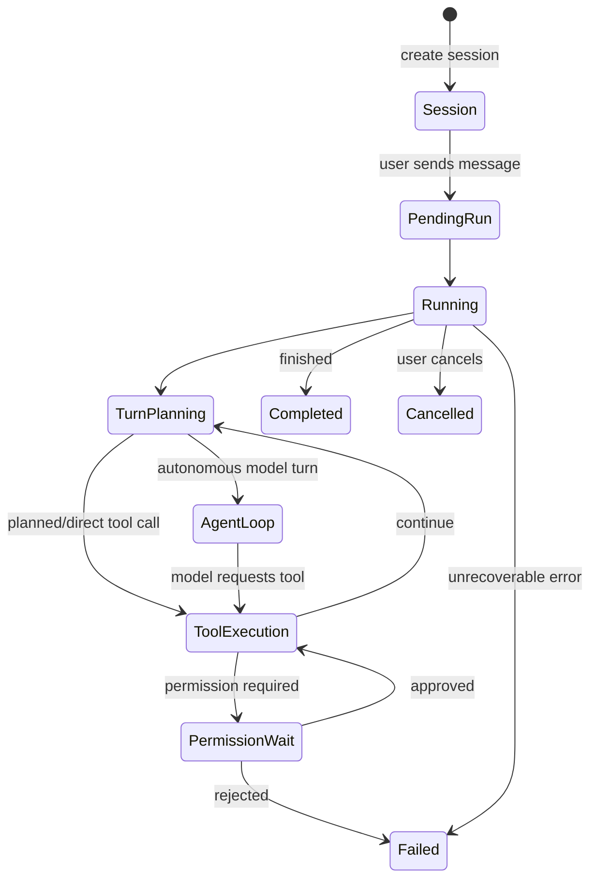

### Agent Roles

| Role       | Purpose                                                                     | Tool access                      |
| ---------- | --------------------------------------------------------------------------- | -------------------------------- |
| `builder`  | Main implementation agent; writes code, edits files, renders, manages tasks | All tools                        |
| `reviewer` | Reviews code and output quality                                             | Read-only tools and review tools |
| `designer` | Produces visual concepts, scene plans, and storyboards                      | Read-only tools                  |

The builder can spawn reviewer or designer subagents through the `task` tool. Child sessions inherit parent permission rules but cannot recursively spawn more tasks.

---

## Studio Turn Planning

Before using the autonomous AI tool loop, the runtime parses user intent and may choose a direct plan.

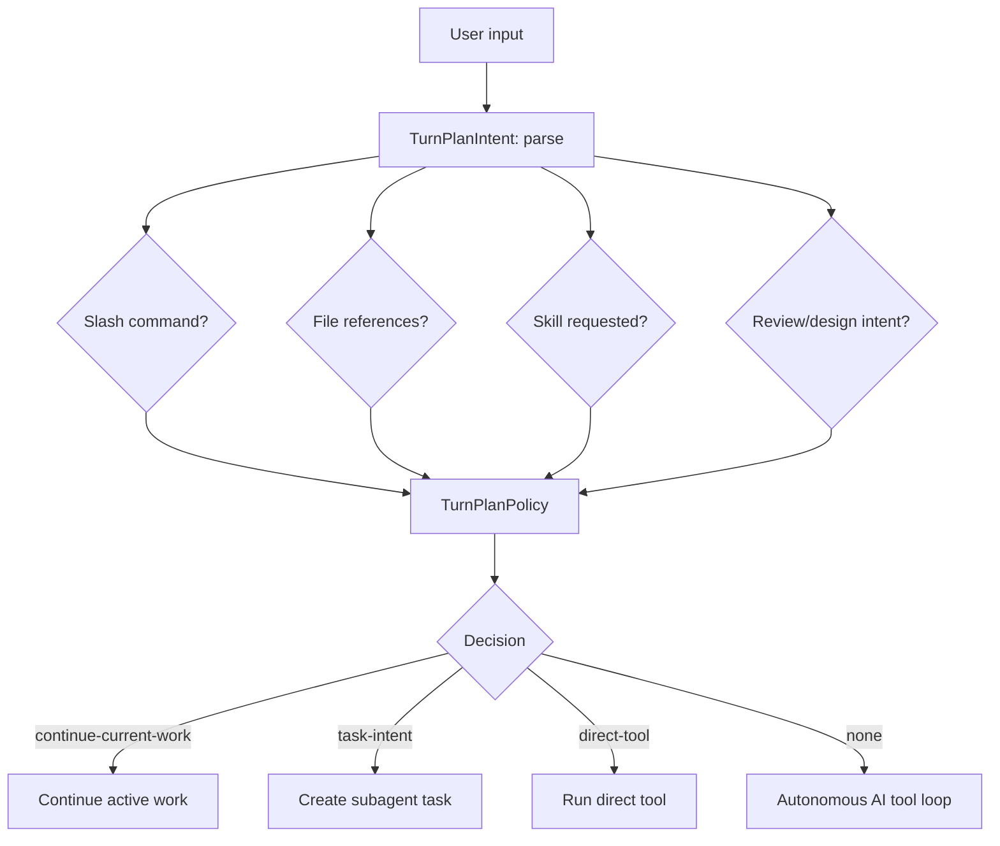

This makes simple commands predictable. For example, `/read file.ts` can become a direct read tool call instead of a full autonomous model turn.

---

## Studio Tools and Permissions

Tools are registered through `src/studio-agent/tools/registry.ts`. Each tool declares name, category, permission, allowed agents, allowed studio kinds, and an execute function.

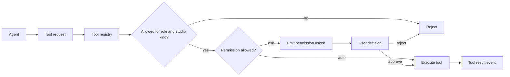

Tool groups:

| Group             | Tools                                                        |
| ----------------- | ------------------------------------------------------------ |
| File operations   | `read`, `glob`, `grep`, `ls`, `write`, `edit`, `apply-patch` |
| Agent operations  | `task`, `skill`, `question`                                  |
| Render operations | `render`, `static-check`, `ai-review`                        |

Permission levels:

| Level | Default behavior                  |
| ----- | --------------------------------- |
| `L0`  | No auto-allowed tools             |
| `L1`  | No auto-allowed tools             |
| `L2`  | Auto-allow read-only file tools   |
| `L3`  | `L2` plus more operational access |
| `L4`  | Auto-allow all tools              |

All workspace file operations resolve paths through workspace guards so tool calls cannot escape the session directory.

---

## Studio Event Flow

Agent Mode uses Server-Sent Events to keep the UI synchronized while runs execute in the background.

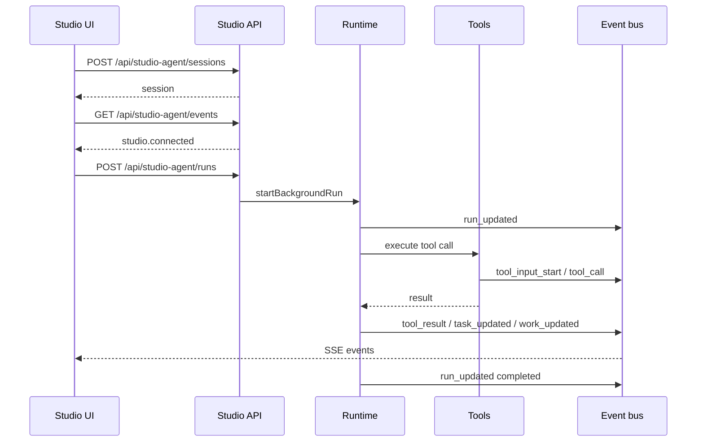

Common events:

| Event                | Meaning                   |
| -------------------- | ------------------------- |
| `studio.connected`   | SSE stream connected      |
| `studio.heartbeat`   | Keep-alive event          |
| `run_updated`        | Run status changed        |
| `assistant_text`     | Assistant text streamed   |
| `tool_input_start`   | Tool input started        |
| `tool_call`          | Tool call received        |
| `tool_result`        | Tool output or error      |
| `task_updated`       | Task lifecycle changed    |
| `work_updated`       | Work lifecycle changed    |
| `permission.asked`   | User approval required    |
| `permission.replied` | User approved or rejected |

---

## AI Routing

StemFun routes AI calls to OpenAI-compatible upstream providers. A request can provide `customApiConfig`; otherwise the server resolves routing by configured StemFun route keys.

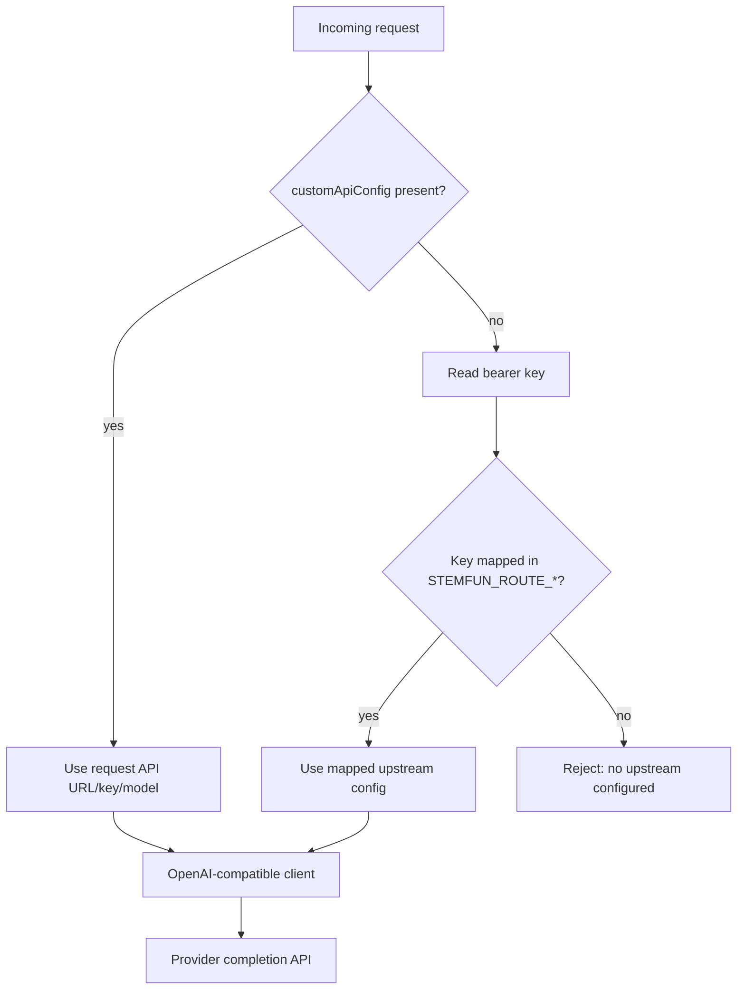

Routing environment variables:

| Variable                 | Purpose                         |
| ------------------------ | ------------------------------- |
| `STEMFUN_ROUTE_KEYS`     | Public keys accepted by StemFun |
| `STEMFUN_ROUTE_API_URLS` | Upstream API base URLs          |
| `STEMFUN_ROUTE_API_KEYS` | Upstream provider keys          |
| `STEMFUN_ROUTE_MODELS`   | Model names for each route      |

This lets different users or deployments route to different providers without changing code.

---

## Frontend Workflow

The frontend is a React SPA with classic generation screens and Studio workspaces.

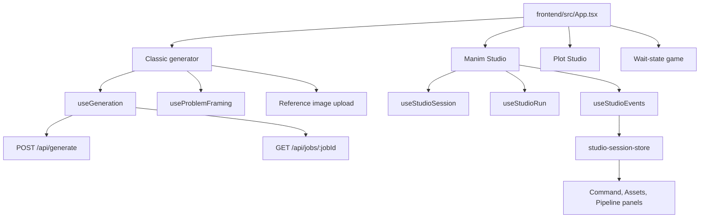

Classic UI:

- Creates generation jobs.
- Displays problem framing plans.
- Uploads reference images.
- Polls job status and result revisions.
- Recovers active job IDs from browser session storage.

Studio UI:

- Creates or loads Studio sessions.
- Starts background runs.
- Subscribes to SSE updates.
- Shows tasks, works, permissions, review findings, and render outputs.

---

## Long Animation and Segmented Rendering

The render system supports segmented output for longer or more complex generations. AI-generated code can include `YON_IMAGE` anchors that split the output into independently renderable segments.

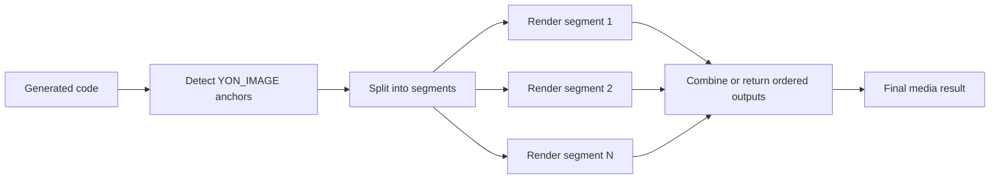

Benefits:

- Reduces timeout risk for long scenes.
- Allows partial isolation of render failures.
- Supports image-mode multi-scene checks with line-offset diagnostics.

---

## Operational Workflow

For local development:

```bash
npm install
cd frontend && npm install
cd ..
npm run dev
```

Expected runtime dependencies:

| Dependency      | Purpose                                       |
| --------------- | --------------------------------------------- |
| Redis 7+        | Bull queue, job state, cancellation state     |
| Python 3.11+    | Manim execution                               |
| ManimCE 0.19.x  | Mathematical animation rendering              |
| LaTeX           | Equation rendering                            |
| ffmpeg          | Video output and audio mixing                 |
| AI provider key | Scene design, code generation, repair, review |

Development workflow:

```mermaid
flowchart TD
    Change["Code/doc change"] --> Read["Read README and relevant docs"]
    Read --> Implement["Implement scoped update"]
    Implement --> Check["Run targeted checks"]
    Check --> Result{"Pass?"}
    Result -->|yes| Report["Summarize changed files and verification"]
    Result -->|no| Fix["Fix syntax/runtime issue"]
    Fix --> Check
```

Recommended checks depend on scope:

| Scope                 | Check                                                              |
| --------------------- | ------------------------------------------------------------------ |
| Backend TypeScript    | `npm run build` or targeted TypeScript check                       |
| Frontend React        | `cd frontend && npm run build`                                     |
| Studio behavior       | Relevant unit tests in `frontend/src/studio` or `src/studio-agent` |
| Manim render behavior | Run a small render job or static guard path                        |
| Docs only             | Verify Mermaid syntax and links by reading generated Markdown      |

---

## Key Design Decisions

1. **Async queue instead of synchronous rendering**: Manim renders can take minutes, so the API returns a job ID immediately and lets the frontend poll.
2. **Two-stage AI generation**: creative scene planning and precise code generation are separate model calls.
3. **Static guard before render**: syntax and type checks catch many AI code mistakes before expensive rendering.
4. **Render retry after runtime failure**: Manim stderr becomes structured context for AI repair.
5. **OpenAI-compatible routing**: deployments can use different model providers without code changes.
6. **Studio session hierarchy**: Session, Run, Task, Work, and WorkResult make long-running agent work inspectable.
7. **Tool registry**: Agent capabilities are declarative, role-scoped, and permission-gated.
8. **SSE for Agent Mode**: users see live tool calls, permissions, task progress, and work updates.
9. **Workspace sandboxing**: file tools operate inside the session workspace only.
10. **Cancellation and cleanup**: active Manim processes can be terminated, and old generated media is removed on a schedule.

---
