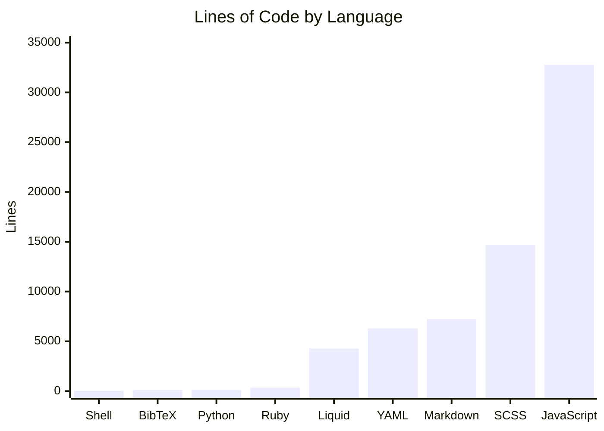
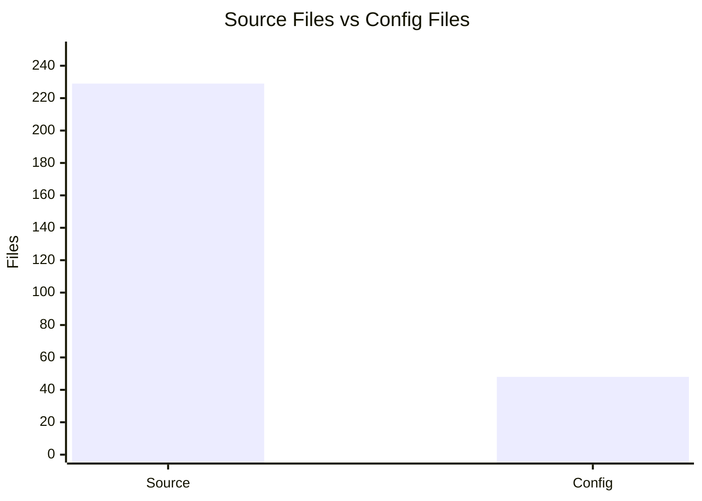

# By the numbers

> Data collected on 2026-05-30

## Size

### Lines of code by language

Counts include only source files (`.md`, `.liquid`, `.scss`, `.rb`, `.yml`, `.js`, `.py`, `.sh`, `.bib`), excluding `node_modules/`, `_site/`, `.git/`, and `vendor/`.

| Language   | Files   | Lines      |
| ---------- | ------- | ---------- |
| JavaScript | 77      | 32,764     |
| SCSS       | 53      | 14,695     |
| Markdown   | 46      | 7,217      |
| YAML       | 30      | 6,297      |
| Liquid     | 49      | 4,279      |
| Ruby       | 7       | 359        |
| Python     | 1       | 132        |
| BibTeX     | 2       | 122        |
| Shell      | 1       | 37         |
| **Total**  | **266** | **65,902** |

> **Note:** JavaScript line count is dominated by bundled vendor libraries (`distillpub/transforms.v2.js` at 14,557 lines, `distillpub/template.v2.js` at 9,616 lines, `tikzjax.min.js` at 4,413 lines). Excluding these, project-authored JavaScript is approximately 4,178 lines.

### Source files vs config files

| Category     | Files   |
| ------------ | ------- |
| Source files | 229     |
| Config files | 48      |
| **Total**    | **277** |

## Activity

| Metric                            | Count |
| --------------------------------- | ----- |
| Total commits (main branch)       | 6     |
| Total commits (all branches)      | 10    |
| Recent commits (since 2026-04-30) | 4     |

### Most changed files

These files have been modified across the most commits:

| File                        | Commits |
| --------------------------- | ------- |
| `_sass/_distill.scss`       | 3       |
| `_sass/_blog.scss`          | 3       |
| `_pages/projects.md`        | 3       |
| `_pages/blog.md`            | 3       |
| `_layouts/post.liquid`      | 3       |
| `_layouts/page.liquid`      | 3       |
| `_layouts/about.liquid`     | 3       |
| `_includes/projects.liquid` | 3       |
| `_includes/header.liquid`   | 3       |

## Bot-attributed commits

| Metric                        | Count |
| ----------------------------- | ----- |
| Commits with `Co-authored-by` | 0     |
| Total commits (all branches)  | 10    |
| Bot-attributed percentage     | 0%    |

No commits in this repository contain `Co-authored-by` trailers.

## Complexity

### Average file size by directory

| Directory        | Avg lines/file | Files | Total lines |
| ---------------- | -------------- | ----- | ----------- |
| `assets/`        | 1,458          | 116   | 169,158     |
| `_data/`         | 738            | 6     | 4,433       |
| `_sass/`         | 281            | 52    | 14,654      |
| `_posts/`        | 219            | 2     | 439         |
| `_layouts/`      | 128            | 13    | 1,665       |
| `_bibliography/` | 115            | 1     | 115         |
| `_scripts/`      | 84             | 7     | 592         |
| `_includes/`     | 72             | 36    | 2,614       |
| `bin/`           | 72             | 4     | 289         |
| `_plugins/`      | 51             | 7     | 359         |
| `_pages/`        | 26             | 13    | 338         |
| `_books/`        | 28             | 1     | 28          |

### Largest source files

| File                                    | Lines  |
| --------------------------------------- | ------ |
| `assets/js/distillpub/transforms.v2.js` | 14,557 |
| `assets/js/distillpub/template.v2.js`   | 9,616  |
| `_sass/font-awesome/_variables.scss`    | 5,130  |
| `assets/js/tikzjax.min.js`              | 4,413  |
| `_data/citations.yml`                   | 4,179  |
| `_sass/font-awesome/_shims.scss`        | 2,193  |
| `CUSTOMIZE.md`                          | 1,402  |
| `assets/js/typograms.js`                | 1,341  |
| `_sass/_base.scss`                      | 1,297  |
| `_config.yml`                           | 681    |
