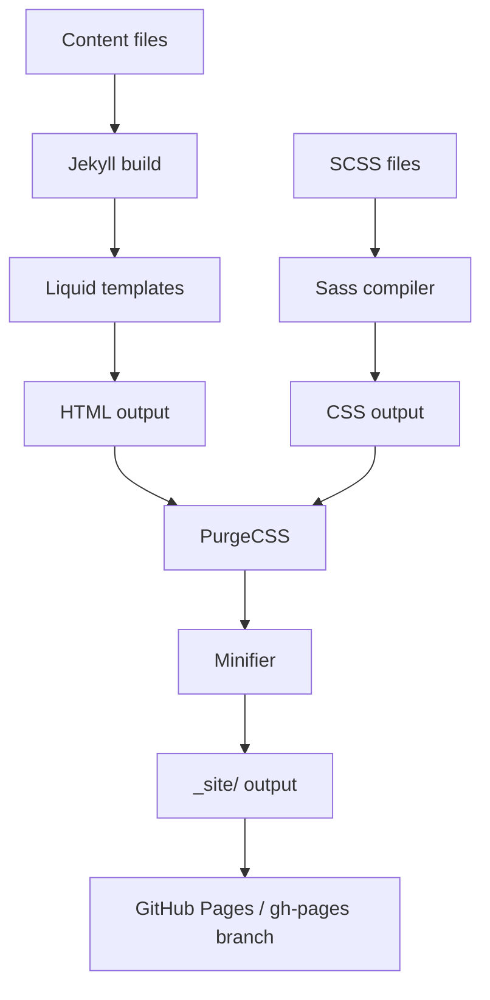
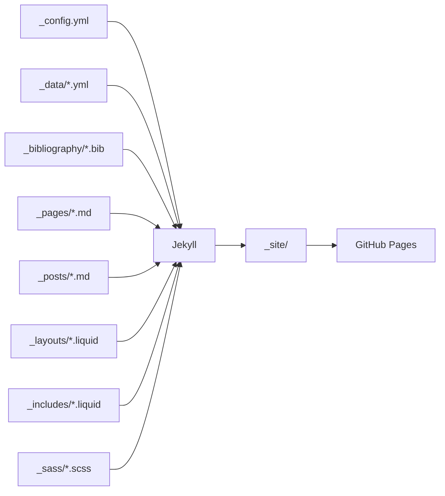

# Architecture

This site is a static site built by Jekyll. The architecture is straightforward: content files (Markdown, YAML, BibTeX) are processed through Liquid templates and SCSS stylesheets to produce a set of HTML pages served by GitHub Pages.

## Build pipeline

### Source files

Content lives in Jekyll collections:

- `_pages/` — top-level pages (about, blog index, CV, publications, projects, etc.)
- `_posts/` — blog posts (naming convention: `YYYY-MM-DD-title.md`)
- `_projects/` — project showcase entries
- `_news/` — announcements displayed on the about page
- `_books/` — book reviews
- `_teachings/` — course listings
- `_bibliography/papers.bib` — BibTeX publications database

### Templates and layouts

`_layouts/` contains the page skeleton for each content type. `_includes/` holds reusable components (header, footer, navigation, analytics scripts, etc.). Layouts use Liquid templating to inject content and configuration from `_config.yml`.

Key layouts:

| Layout | Purpose |
|--------|---------|
| `about.liquid` | Profile page with avatar, bio, news, and selected papers |
| `post.liquid` | Blog post with metadata, TOC, and related posts |
| `bib.liquid` | Publication entry with badges (Altmetric, Dimensions, Google Scholar) |
| `cv.liquid` | Full CV page rendered from `_data/cv.yml` |
| `distill.liquid` | Distill-style interactive articles |
| `page.liquid` | Generic content page |

### Styling

SCSS files in `_sass/` compile to CSS. The theme system (`_sass/_themes.scss`) supports light and dark modes. Key files:

| File | Purpose |
|------|---------|
| `_sass/_base.scss` | Base styles, layout grid, responsive breakpoints |
| `_sass/_themes.scss` | Light/dark color variable definitions |
| `_sass/_navbar.scss` | Navigation bar styles |
| `_sass/_publications.scss` | Publication list styling |
| `_sass/_cv.scss` | CV page layout |
| `_sass/_utilities.scss` | Utility classes |

### Plugins

The `Gemfile` declares ~20 Jekyll plugins. Notable ones:

- `jekyll-scholar` — BibTeX bibliography processing and citation rendering
- `jekyll-paginate-v2` — Blog pagination
- `jekyll-archives-v2` — Tag/category/year archive pages
- `jekyll-minifier` — HTML/CSS minification
- `jekyll-imagemagick` — Responsive image generation (WebP)
- `jekyll-toc` — Table of contents generation
- `jemoji` — GitHub emoji support

Custom plugins in `_plugins/` extend Jekyll with citation fetching (Google Scholar, InspireHEP), external post importing, and accent removal.

## Deployment

GitHub Actions (`.github/workflows/deploy.yml`) builds the site on push to `main`:

1. Checkout code
2. Set up Ruby 3.3.5, Python 3.13, Node.js
3. Install ImageMagick, nbconvert
4. `bundle exec jekyll build` with `JEKYLL_ENV=production`
5. Run PurgeCSS to strip unused CSS
6. Commit built output to `gh-pages` branch

The `gh-pages` branch is served by GitHub Pages.

## Data flow

## Key source files

| File | Purpose |
|------|---------|
| `_config.yml` | Central configuration: site metadata, feature flags, plugin settings, library versions |
| `Gemfile` | Ruby dependency declarations for Jekyll and all plugins |
| `Dockerfile` | Docker image definition for local development |
| `docker-compose.yml` | Docker Compose config mapping port 8080 and source volume |
| `bin/entry_point.sh` | Docker entry point: starts Jekyll with livereload, watches `_config.yml` for changes |
| `purgecss.config.js` | PurgeCSS configuration for production CSS optimization |
| `.github/workflows/deploy.yml` | Main CI/CD deployment workflow |
| `.github/workflows/prettier.yml` | Code formatting enforcement workflow |
